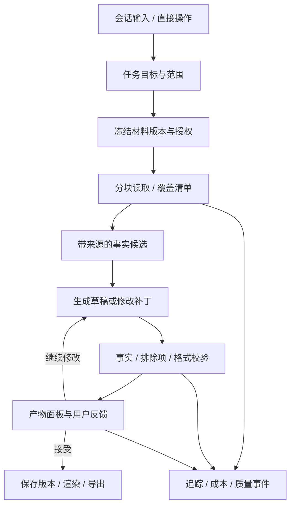

# 工作记录与 Agent 工作台：产品架构与持续优化

日期：2026-09-16。状态：设计建议，尚未实现。依据用户最新要求，补充[产品设计](找工作工作台-产品研究与功能设计.md)、[技术方案](找工作工作台-技术实现方案.md)；工程入口为[专项任务](../../tasks/agent-workspace.md)。

## 1. 判断：这是值得建设的长期能力

工作记录解决的是简历生成之前的材料缺失：做过什么、为什么做、本人负责多少、结果怎样，往往在项目结束后逐渐忘记。把记录、证据、整理、简历和面试连接起来，可以使平台在工作期间也有使用价值。这是产品假设，需要验证长期记录负担和实际转化价值，不应直接当成已证明的留存或商业收益。

建议产品形成一条连续路径：**随手记录 → 回顾项目 → 提炼有依据的成果 → 按目标生成简历 → 持续对话修改 → 用于投递和面试**。阅读和思考也可以只作为个人知识，不强迫每篇笔记都变成简历条目。

AI 会话成为默认主入口；记录、简历编辑器、日历、投递表和版本面板仍然是直接可用的工具。聊天负责表达意图和协调步骤，具体结果以可操作的文档、差异和列表交付。衡量减少的是完成目标所需的操作和认知负担，不能以增加聊天轮数作为产品进步。

可复用的资产包括任务运行、授权上下文、工具协议、版本化产物、反馈与评测系统。先用“笔记生成简历”和“面试复盘”两个真实场景验证边界，再抽出稳定模块；不在业务尚未成立前建设包揽所有行业的通用 Agent 平台。

## 2. 工作记录区：随手记得下，需要时找得到

一级导航建议为“工作与成长记录”，简称“记录”。所有求职阶段可用，也允许当前不求职的用户持续记录；不要求为了写笔记先创建一次求职计划。

### 2.1 基础交互

默认空白输入支持纯文本与 Markdown，自动保存；可选项目、记录日期、标签、类型。类型包含工作日志、成果、问题与复盘、学习思考、读书笔记、其他，自定义标签可扩展。模板只是提示，不能把每日记录变成填写绩效表。

提供按日期的时间线、按项目的聚合和全文检索。先支持手动输入、粘贴、Markdown／文本导入和链接；附件复用现有私有文件服务。语音速记可在语音底座就绪后接入，转写确认后才作为笔记正文。第三方笔记同步采用后续独立适配，不默认获取整个外部账户。

记录编辑、恢复版本、归档、删除、Markdown 导出必须直接可用。项目归档不删笔记；记录数量和打卡天数不是目标，不用连续签到惩罚偶尔记录的用户。记录提醒由用户选择频率，也可完全关闭。

### 2.2 可选记录提示

工作记录可提示：背景／问题、我具体做了什么、采取什么方法、结果与证据、学到了什么、下次要改什么。没有数字时允许写定性结果；AI 可以问“是否有可核对的数据”，不能自行补上效率提高百分比。

读书笔记可保留书名、链接、引用片段、个人理解和实践。阅读过一种技术不能直接写成“熟练掌握”；读到的案例不是本人项目；团队成果不能直接归为个人贡献。笔记中的设想、计划、已完成工作分别标记。

### 2.3 与既有模块的关系

| 对象 | 作用 | 与记录的关系 |
|---|---|---|
| 记录库 | 原始工作／学习材料 | 保留当时文字、上下文与版本，默认私人 |
| 经历与证据库 | 用户确认的结构化事实 | 从记录提炼的候选条目经用户确认后写入；不是自动同步所有笔记 |
| 复盘库 | 真实面试／模拟的专门文档 | 可共用文档存储和编辑器，但保留来源类型、问答关联和独立视图 |
| 简历 | 面向目标岗位的表达 | 引用确认的事实，固定材料与模板版本，不反写原始记录 |
| 对话 | 意图、任务过程和反馈 | 持有选定上下文；不是另一个唯一存放结果的地方 |

工作笔记可能含客户名、内部指标、同事资料和未公开项目。提供“禁止用于简历／外部分享”“生成时匿名化”等记录级与段落级控制。允许 AI 读取与允许对外发布是两种权限；生成前显示输出用途，用户复核具体内容。

## 3. AI 首页：能行动，也能看见结果

求职者登录后的默认首页改为“AI 工作台”，中心是会话输入，提供少量明确入口：“记一下今天的工作”“用这些记录生成简历”“为这场面试做准备”“整理这个项目”。顶部仍可选择实习／校招／社招与目标市场，也可保持“日常积累”状态；后者是使用状态，不增加第四类求职阶段。

“今天”保留为导航和首页辅助区域，展示用户自己的待办与日程，不由 Agent 自动堆满任务。用户可把默认落地页改成今天、记录或上次工作区。HR、猎头和管理端保留各自工作入口，不强迫所有角色使用求职者聊天首页。

桌面布局建议：左侧导航／历史会话，中间会话，右侧可折叠产物面板。用户批量勾选笔记、查看来源、接受差异和编辑简历时使用直接操作。移动端以会话／材料／结果切换保持当前任务，不挤成三栏。

对话开始前可见当前范围：选了哪些笔记、哪个版本、目标简历和岗位、哪些资料未选、是否允许补充检索。用户无需理解 tokens、工具调用或 Agent 内部术语。进度只展示真实任务状态，如“已读取 8/10 篇；2 篇待处理”“发现 3 处数据冲突”，不伪造工作进度，也不展示模型隐藏思维过程。

结果必须是可命名、继续编辑、保存版本、导出并在“我的简历”找到的对象，不能只在聊天里输出一大段文字。

## 4. 端到端示例：从项目记录生成简历

用户勾选 12 篇工作笔记和 2 篇读书笔记，输入：“准备后端社招简历，突出缓存改造和稳定性；不要包含客户名称，读书笔记只用于总结学习内容。”

1. 创建任务与材料清单，冻结这 14 篇的明确版本、允许使用的段落和附件范围，显示目标及隐私要求。资料已授权、意图明确时直接执行，不重复询问许可。
2. 阅读所有选定材料，按项目归并、去重，抽取事实候选与原文位置；读书材料保持知识来源类型。
3. 标记冲突：“两篇记录的响应时间分别为 180ms 和 120ms，是不同阶段还是同一指标？”只有影响事实或输出的缺口才集中提问；其他部分继续整理。
4. 生成成果卡：背景、本人行动、结果、证据、时间、待确认点。原文“我们完成迁移”不能自动改成“我主导迁移”。
5. 根据目标岗位生成简历草稿，附每个关键陈述的来源；不包含被禁止的名称或未确认数字。阅读总结不会伪装为生产项目成果。
6. 用户反馈：“第二段太泛；不要第三个项目；保留两页。”生成定向补丁，保留其他已确认内容和排除项。
7. 在结果面板查看差异、直接修改或继续对话；接受后保存独立简历版本并渲染。原始笔记保持不变。
8. 下次新增材料时选择“用新增记录更新”，显示新增依据与拟改条目，不能静默修改旧版本或已投递快照。

### “全部读取”的可验证含义

选中材料不能只做 top-k 检索后声称全读完。建立 CoverageManifest：每篇笔记的 revision、正文分块、附件解析状态、已处理块、失败块、跳过原因与来源位置。短材料直接处理；长材料分块全量读取、事实抽取、合并去重，必要时回查原文。摘要不替代原始证据。

选定的是正文还是正文加附件必须明确。PDF 解析失败、图片未 OCR、超长材料超预算时显示具体缺口，允许分批处理或排除；不能用部分结果标记“全部完成”。所有块处理成功只是处理覆盖完成，不保证模型理解无误，仍需来源与事实验收。生成任务的完成条件同时包括覆盖、质量与用户可使用的产物。

## 5. Harness：管理整个任务生命周期

沿用 ADR-004 的持久工作流，扩展为产品无关的运行层。一个运行实例 `Run` 处理一个明确目标；`Conversation` 可含多个 Run，后续修改使用父 Run 和产物版本建立关系。模型对话历史不是唯一恢复依据。

### 5.1 状态、控制与工具

Run 状态为 queued、running、awaiting_input、awaiting_review、succeeded、failed、cancelled、expired。区分等待补充事实与等待审阅产物。持久化步骤输入／输出引用、工具版本、预算、耗时、错误类别、幂等键和父子关系。页面刷新、worker 重启与短暂供应商故障可恢复；重放不是重新执行已发生的副作用。

用户可暂停后续步骤、取消、修改目标、移除材料、重新生成或复制任务。取消不承诺已发出的模型调用免费撤回；明确显示已发生费用和已保存草稿。执行中新增要求提升 task revision，旧运行输出标记过时，防止迟到结果覆盖新意图。

工具有稳定 schema、版本、权限 scope、副作用级别、预算与幂等语义：读取已选材料、检索已授权范围、生成事实卡、修改草稿、渲染预览、保存确认版本。模型不能生成任意数据库查询或自行扩大材料范围。

用户请求“生成简历”已授权创建私有草稿与预览，不必每个内部步骤都确认。发布到市场、分享给招聘者、真实投递、支付与不可恢复删除则走具体业务确认；审批绑定参数、对象版本、范围和有效期，参数变化后不能复用旧确认。

### 5.2 事实与来源结构

建议对象：Note、NoteRevision、Project、SourceSelection、CoverageManifest、EvidenceClaim、Conversation、Run、StepRun、ArtifactRevision、ArtifactPatch、Feedback、EvalCase、ReleaseConfig。

EvidenceClaim 包含 sourceRevision／block／span、材料类型、发生时间、主体、行动、结果、数字及口径、支持／冲突来源、待确认状态和用户修订。来源证明“用户材料里这么写”，不等于独立验证现实世界真实性。AI 置信度不当作事实判决。

既有经历库可接收被用户确认的 claim；简历字段保留 claim ID 和生成来源，但投递 PDF 默认不携带内部引用或私人链接。读书摘录、推测和计划不可自动提升为已完成成果。冲突检测失败仍可能发生，用户可逐条定位并纠正。

### 5.3 上下文和长期记忆

工作区上下文只包含本次材料、必要事实、目标、排除项、已接受补丁与待解问题。超长历史压缩时保留这些结构化约束；不能只压缩自然语言聊天而丢掉“不要包含某段经历”。

偏好记忆与事实记忆分开。语气、篇幅、排版偏好可向用户建议保存；项目事实需要来源和确认。跨会话记忆可查看、修改、删除，不能由一次临时要求永久改变偏好。不同账号、组织和产品的私人记忆不共享。

移除来源后停止后续读取，并提示现有草稿有哪些条目依赖它，提供删除／重新生成；不能假装已经发送给模型的数据被追溯撤回。删除笔记时先撤销未来使用，异步清理索引、缓存与派生副本按策略执行。来源的版本快照同样受删除策略管理，不以“不可变”为由无限保留私人原文；保留非正文的删除标记供版本解释。已导出到外部的材料无法由平台收回。

### 5.4 质量闸门

确定性规则优先检查必填字段、日期和数字变化、排除项、预算、授权、schema；语义校验再检查贡献归属、事实支持、遗漏与表达质量。模型评审只能作为辅助，不能由同一模型一句“正确”自动放行。

并发修改按 baseArtifactRevision 对比；冲突转差异合并。工具异常有限重试，不对确定性错误无限重试。验收集包括来源提示注入、混合语言、遗漏附件、矛盾数字、读书笔记冒充成果、团队贡献归属、隐藏条目复活、重启重复保存与新指令覆盖旧输出。

## 6. 可复用框架：抽出稳定边界，保留业务判断

| 层次 | 可复用内容 | 本产品承担的内容 |
|---|---|---|
| 交互组件 | 会话、材料选择、进度、产物面板、差异确认、反馈 | 简历预览、经历卡、面试日程 |
| 运行内核 | 状态机、检查点、预算、取消、重试、版本与工具注册 | 求职任务工作流与完成条件 |
| 上下文与权限 | 范围、来源、授权快照、检索过滤、可删除记忆 | 简历显隐、猎头社招限制、按单服务授权 |
| 产物协议 | 创建、补丁、版本冲突、导出钩子 | ResumeDocument、Markdown复盘、模板引擎 |
| 观测与评测 | 事件 schema、trace、费用计量、反馈关联、实验配置 | 事实保真、网申错填、面试反馈质量评测 |
| 领域模块 | 通过接口接入 | 岗位、市场、返现、HR/猎头逻辑保持在各自模块 |

建议在现有单仓库新增 `packages/agent-runtime`、`packages/agent-contracts`、`packages/agent-ui`、`packages/telemetry` 和 `quality/agent`。先建立边界与契约，随后用第二个场景证明接口可复用，再考虑独立发包。共享代码不等于共享私人用户数据、提示词或行业评价标准。

首期使用有界工作流与工具循环，只有评测证明某一步需要动态规划时才增加规划器；多 Agent 协作不是目标本身。框架需能替换模型与评测后端，但不同时建设大量未使用的供应商适配。

## 7. 埋点与后台：先明确要回答的问题

后台首先回答四个问题：用户有没有完成想做的事；在哪一步卡住且为什么；结果是否可信并被实际使用；每次成功交付消耗多少时间和成本。

分开业务分析事件、运行日志／指标／trace、安全审计、用户授权研究样本四条数据路径。不同目的、访问权限与保留期限不能因为都叫“日志”而混在一起。技术信号采用 OpenTelemetry 接入思路，关联 API、队列、工具和模型跨度；指标、日志与 trace 各司其职。[官方信号说明](https://opentelemetry.io/docs/concepts/signals/)。

### 7.1 事件契约

| 事件 | 回答什么 | 允许的主要字段 |
|---|---|---|
| note_saved | 是否能轻松积累材料 | 类型、保存方式、长度区间；不含标题与正文 |
| generation_requested | 用户从何处发起什么任务 | 意图类别、来源数量区间、入口、语言、市场 |
| source_read_completed / source_read_failed | 有没有真的处理全部选择 | revision引用、块数、解析状态、失败码；详细引用只进受限运行记录 |
| clarification_requested / resolved | 哪里需要用户补充 | 缺口类别、等待时长，不存具体敏感问题到分析事件 |
| artifact_proposed | 是否交付了可用草稿 | 类型、覆盖状态、校验状态、版本标签 |
| patch_accepted / rejected / edited | 建议是否有用 | 操作、拒绝原因类别、范围大小；不含修改前后正文 |
| artifact_saved / exported | 产物是否进入使用环节 | 类型、版本引用、输出格式、渠道类别 |
| run_failed / cancelled | 失败还是用户主动停止 | 失败码、步骤、是否可恢复、耗时、成本 |
| feedback_submitted | 用户明确认为哪里不好 | 结构化类别；自由文本单独受限保存 |

事件携带 schemaVersion、eventId、发生／接收时间、匿名化主体标识、session/run/trace关联、workflow/model/prompt/tool版本、实验配置。假名 ID 仍按可关联个人数据管理，不宣传为完全匿名。服务端状态是保存／成功事件的权威，浏览器点击不能代替完成；幂等去重并区分测试账号、员工、机器人和真实用户。

模型产生新任务类型时不能临时生成无限事件名。指标 label 仅用有限枚举，不放 userId、noteId、runId、原始 URL；详情关联放受限日志或 trace，控制基数与费用。

### 7.2 指标的定义与解释

| 指标 | 建议口径 | 防止误解 |
|---|---|---|
| 技术交付成功率 | 校验通过且产物持久化成功的运行 / 已到结算窗口的运行 | 单列取消、等待用户和供应商失败，不把它们隐藏 |
| 来源覆盖完成率 | 所有已授权选中块都成功处理的运行 / 要求全读的运行 | 处理完成不等于全部理解正确 |
| 首个可用草稿耗时 | 请求到首次可审阅产物，p50/p95 | 单列排队、计算与等待用户时间 |
| 有用交付率 | 交付后窗口内保存／导出或明确有用反馈的任务 / 已交付任务 | 保存不必然有用，多指标交叉验证 |
| 重大事实修正率 | 明确标记事实错误的受评估产物 / 有质量评估的产物 | 缺反馈不算正确；说明采样偏差与样本量 |
| 人工修正负担 | 达到用户可用版本的编辑轮数／操作与时间 | 少聊可能是放弃，不能孤立追求轮数少 |
| 单次成功任务成本 | 所有尝试及重试成本 / 成功任务数 | 失败成本不能排除，以免低估 |
| 长期记录价值 | 合适观察窗口内再次记录、回顾、引用材料的用户比例 | 求职有阶段性，不要求每日活跃；就业离开不必然流失 |

可以将“每周完成至少一项有用职业任务的用户数”作为候选主指标，同时以事实错误、隐私、成本和失败率为约束。录用结果受到市场和用户条件影响，只能作为自愿报告的滞后观察，不能归因于 Agent 一项功能。

按实习／校招／社招、任务、材料规模、语言、市场、版本观察差异；小群体不展示可识别明细。不要从行为数据推断用户没有表达过的敏感心理特征。

## 8. 反馈、评测与发布形成闭环

在关键产物旁提供轻量反馈：有用／需要修改，以及事实不对、遗漏材料、表达不合适、没按要求、太慢、操作麻烦、其他。用户可定位某段并描述问题；选择是否附带那段输入／输出，预览脱敏后提交。运行 ID 可自动带入，全文默认不附带。

隐式信号包括接受、撤销、连续重试、手动改写和放弃，但都只能提出假设：重试可能是探索而非不满；高编辑率可能反映精细偏好而非低质量。通过自愿访谈、明确反馈和案例审查理解用户意图，不能把埋点当作读心术。

改进流程：发现问题 → 按失败类别聚合 → 获得所需样本授权／制作合成复现 → 人工标注预期结果 → 加入版本化评测集 → 修改提示、工具、检索或界面 → 回归与盲评 → 小范围发布 → 观察护栏 → 放量或回滚。优先修信息选择、工具和交互问题，不把每个错误都归结为模型不够大。

评测集分开发、留出、发布门槛集合；相同用户、项目或近重复材料避免跨集合泄露。合成集不能替代真实分布检查；用户授权样本撤回有删除／禁用机制。模型裁判须校准并由人工抽查；新版本不能只跑它擅长的样本。

实验按用户或稳定任务群分组，预先定义主要指标、观察窗口、最小样本及停止条件。低流量阶段采用人工病例评审和分批上线，不制造统计显著结论。安全、事实与权限规则不因实验分组而降低。配置同时版本化模型、提示、工具、检索、工作流和 UI，便于定位变化；上线不自动用原始用户对话训练模型。

## 9. 后台功能与告警

后台分为任务运行台、产品漏斗、质量反馈队列、成本与容量、评测／版本发布、告警事件六个视图。负责人默认看到汇总、错误码和必要上下文；查看私人正文需要用户授权或已定义的受限故障处理权限、访问理由与审计。普通运营不能随意翻阅工作笔记。

每个告警有负责人、去重键、阈值和持续时间、处置手册、通知渠道、恢复通知；设置 page（立即处置）与 ticket（排期处理）两级。以下是待基线校准的首轮规则建议，不是实测 SLO：

| 症状 | 初始规则与动作 | 首要排查 |
|---|---|---|
| 越权工具调用成功／隐藏事实泄露 | 确认一例即 page，关闭相关工具／工作流并隔离范围 | 授权版本、材料投影、来源与补丁链 |
| 生成持续失败 | 10分钟至少20次执行且失败率>5%，page；低流量用合成探针补充 | 供应商错误、最近版本、队列、配额 |
| 用户长期收不到结果 | 最老可执行任务等待>2分钟且持续5分钟，page；不含等待用户 | worker存活、积压、限流与超时 |
| 保存失败／重复产物 | 持久化不可恢复错误或幂等不变量破坏，page | 数据库、outbox、任务重放 |
| 费用异常 | 单任务达到配置上限立即停后续调用；日预算接近上限发ticket，失控扣费page | 重试次数、输入规模、模型路由 |
| 有用交付率下降 | 达到规定样本量后超出基线容忍区间，ticket，暂停继续放量 | 分群、反馈标签、实验版本；不以单条差评告警 |

告警验证包含主动制造供应商错误、任务中断和受控拒绝权限，确认 trace 可关联、消息到达、处置手册可用。Telemetry 后端故障不应阻止用户保存原文；关键业务审计和任务状态仍写主库。埋点缺失率、事件重复率、trace断链本身也需要监控。

## 10. 数据边界与保留建议

默认普通分析不收正文、简历、完整提示、附件、录音、密钥或原始页面。研究样本单独主动授权，拒绝不影响基础服务；撤回后不再用于新的评测构建或训练。供应商处理与留存依据实际配置说明，不能笼统宣称“只在本地”。OpenTelemetry 也提供敏感数据识别与处理指引；本项目仍需在采集入口实行字段白名单，不能只靠下游脱敏。[官方敏感数据说明](https://opentelemetry.io/docs/security/handling-sensitive-data/)。

建议初始保留策略：原始运行诊断元数据30天、产品事件90天、去标识汇总12个月；用户笔记、对话与产物按用户可管理的产品保存策略；授权样本单列到期日。安全审计、交易和备份另按实际要求确定。上述是设计默认候选，上线前根据用途、成本和运营地区确定并对用户说明。

删除请求涉及主库、对象、索引、向量、缓存、样本和备份恢复后的删除重放；建立删除状态与验证。可复用框架不能使一个产品的私人笔记进入另一个产品的模型上下文。

## 11. 护城河与实施顺序

可能形成优势的是：用户愿意持续积累的个人材料；可靠的领域工具与适配；经授权并校验的失败案例和评测；理解真实任务的交互；稳定成本与交付质量。单纯存很多日志或包一层聊天框不足以构成优势。用户仍应能导出自己的记录和简历，长期价值来自好用和可信。

实施顺序：M1/M2 建记录与来源版本，M2–M4 接会话和产物循环，首个真实 Agent 上线前已有事件、trace与成本，M4 完成质量反馈与回归，M6 验收后台告警和发布回滚。第二个场景以私密面试复盘复用 harness，验证通用边界。先不拆成独立多租户 SaaS，不引入与当前需求无关的插件市场或自动自我改代码机制。

完整验收示例：20篇笔记跨两个项目，其中有矛盾数字、团队成果、阅读摘录和隐藏客户名；系统全部处理并报告覆盖，集中询问必要缺口，产物保留事实来源；用户反馈后只改指定段落；刷新可恢复；导出不泄露排除内容；后台能定位失败和成本但不暴露正文；模型新版本上线前复现并通过这些案例。
