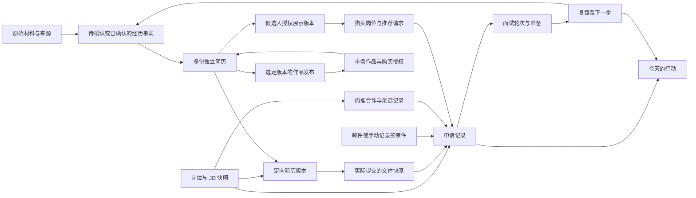

# 中国互联网与技术人才求职平台：产品研究与功能设计

## 1. 产品定位：覆盖实习、校招、社招的完整平台

**连接求职者、简历创作者、企业内推人、猎头及人工求职服务方，为中国互联网与技术类人才提供从准备、找机会、投递、面试到入职的完整平台。**

个人工作台承载持续求职流程：知道我有什么经历、这个岗位需要什么、当时投了什么、现在该做什么。简历市场提供可购买、可编辑的优质内容；公司区连接岗位和内推；猎头工作台帮助专业招聘方找到有意愿的候选人并完成交付。

三类人群均属于产品范围，完整平台是目标。功能之间形成连接，建设顺序按依赖安排，每条业务流程都要有可用的入口、交付结果和后续服务。

1. 闭源 [FResume 网站](https://fresume.odsy.com.cn/onboarding/start) 已有投递记录册，而且可以关联简历。增加一个看板本身不构成超越。
2. [Reactive Resume](https://github.com/reactive-resume/reactive-resume)、[Resume-Copilot](https://github.com/Isla7940-s/Resume-Copilot)、[career-ops](https://github.com/career-ops-hq/career-ops) 等已跨越单一简历编辑，覆盖投递、上下文、面试或 Agent 工作流。
3. Harness 的价值在于让任务有依据、能检查、可恢复，而不是给多个聊天窗口取不同 Agent 名字。

建议验证的产品主张是：**少重复填写、少维护状态，针对每个机会产出有依据的材料，并把面试反馈转成下一步行动。** 竞争优势需要用任务完成质量和省下的时间证明，不能用功能数量或“AI 匹配分”证明。

### 服务人群与价值

服务于中国互联网/技术类的实习生、校招生和社招求职者。让用户愿意来的原因包括：好用的多简历编辑、有参考价值的简历市场、有效岗位和内推渠道，以及社招模式中的专业猎头服务；让用户持续使用的原因是材料、申请、面试和机会沟通都能在这里接续完成。

平台范围由这些完整场景决定。功能是否好用、资源是否有效、交易是否可信是共同的完成标准。

## 2. 三类入口与多方角色

### 求职者先选一种模式进入

首次进入明确呈现三个同级选项：**找实习 / 校园招聘 / 社会招聘**。选一个进入对应首页，再选“已有简历 / 从零创建 / 从市场选一份开始”。不会用毕业年份替用户锁死入口，也不让用户先回答大量问题才能进入。

| 模式 | 主要资料与筛选 | 首页与机会组织 | 材料和面试重点 |
|---|---|---|---|
| 实习 | 毕业时间、可到岗时间、每周天数、持续月数、城市、是否希望转正 | 日常实习/暑期实习/转正机会，到岗匹配、进度与截止提醒 | 课程项目、实践、技能基础；不能因没有正式工作经历而无法建简历 |
| 校招 | 毕业届别、学校/专业、目标方向、城市；企业自己的应届资格说明 | 招聘季、提前批/正式批/补录、宣讲/笔试/面试日历、内推 | 项目与实习、笔试准备、多轮面试、Offer 比较 |
| 社招 | 工作年限、专业方向/级别、意向岗位与城市、到岗周期、期望薪酬、求职公开范围 | 有效岗位、猎头邀约、内推机会、保密求职、流程与 Offer | 工作成果、业务规模、个人职责、职业变化与技术深度 |

“校招资格”以具体岗位要求为准，界面提示未知或需核实，不用平台的一条年龄/年份规则替代所有企业规则。

顶栏可以切换模式；同一账号可创建多个求职计划，例如“2027 校招”和“暑期实习”。经历库共享，申请、默认筛选、目标简历和统计按计划组织。切换不会丢失历史，也不会把校招投递改成社招投递。统计可选择当前计划或全部计划。

### 一个账号可以拥有多种身份，但权限分开

| 身份 | 使用空间 | 提供什么 | 得到什么 |
|---|---|---|---|
| 求职者 | 个人求职工作台 | 自选材料、意向、申请反馈 | 工具、机会、内推；社招可选猎头邀约 |
| 简历创作者 | 创作与交易中心 | 自己有权发布的简历样例、模板、讲解 | 销售分成、作品曝光、口碑 |
| 企业内推人 | 公司内推合作台 | 有效推荐入口、岗位说明、实际推荐与跟进 | 合格候选人、推荐管理、可核查效果 |
| 猎头/猎企（人工核验并邀请开通） | 社招猎头工作台 | 真实委托岗位、专业沟通、推荐交付 | 经授权的人才机会、业务工具、合作渠道 |
| 人工求职服务方（负责人对接开通） | 服务接单台 | 简历修改、模拟面试、面试辅导 | 获客、预约及交付管理；按约定向平台付费 |
| 平台运营 | 运营后台 | 审核、供给维护、结算与纠纷处理 | 多方质量和经营数据 |

求职者可以同时成为创作者或内推人。身份转换不自动获得别人私有材料的权限。企业直接招聘账号属于平台扩展角色，先定义与猎头的职位授权关系，具体企业端深度另行设计。

## 3. 闭源 FResume：实际看到了什么

**它与 `slurrystyles/fresume` 是两个不同项目。**

| 区域 | 本轮实际观察 | 可借鉴之处 | 仍未验证/可改进方向 |
|---|---|---|---|
| 入门 | 从零生成、已有简历两条路径；引导页强调 5 分钟 | 对不同起点降低决策成本 | “5 分钟”是产品承诺，本轮未计时验证 |
| 从零生成 | 8 步引导；查看了前两步：基本资料及方向；支持暂存退出 | 不强迫用户先懂简历结构 | 其余步骤及最终生成质量未走通 |
| 职业方向 | 多职业类别、自定义、不知道做什么；可结合课程推荐 | 用材料辅助方向探索 | 空资料触发推荐时明确提示信息不足，没有凭空给出精准结论，这点值得保留 |
| 个人知识库 | 基本资料、教育、奖项、经历分类；自动整理；新增经历有重复检查提示 | 经历可长期积累，不只存 PDF | 去重质量、事实来源、冲突处理未验证 |
| 上传 | 实际上传页支持 PDF / DOCX，文件上限 10MB；PDF 转 Word；照片上限 5MB | 两种主流输入均接纳 | 不能根据入门页只提 DOCX 就断言不支持 PDF；转换版式未测试 |
| 简历工作区 | 可拖拽卡片、简历库、7 天回收站；帮助区区分原始与生成简历 | 轻量素材管理、删除可恢复 | 帮助文案明确称原简历与匹配生成简历独立、相互无关联；可做版本来源链，但不能据此断言它没有应用记录关联 |
| 大厂公司区 | 界面显示 250 条；分类、官网/招聘链接 | 降低找入口成本 | 包含公司首页、招聘页及重复项；不能视为 250 个已验证开放岗位 |
| 秋招信息源 | 界面显示 167 家公司、分类、官网直达 | 针对季节性求职组织入口 | 未逐条核查有效性；公告提及 2026 年 7 月提前批，不代表所有数据失效，但应提供逐条更新时间 |
| 投递记录册 | 搜索、新增；公司、岗位、简历选择、投递时间、阶段、网申地址 | 已具备“申请关联简历”的基础闭环 | 新增表单中看到已投递/待笔试/待面试；没有实际保存，不能断言其他流程不存在 |
| 订阅 | 短期/月度套餐与反馈换长期权益，人工激活说明 | 求职有阶段性，短周期付费自然 | “无限制”表述与每日配额并列时易困惑；我们应明确计费单位和剩余额度 |

来源：[登录后入口](https://fresume.odsy.com.cn/wall)、[知识库](https://fresume.odsy.com.cn/wall/knowledge)、[简历区](https://fresume.odsy.com.cn/workspace/resume)、[上传页](https://fresume.odsy.com.cn/upload)、[投递区](https://fresume.odsy.com.cn/workspace/delivery)。登录态内容可能无法通过普通网页抓取复现，以上为本轮界面记录。

用户截图还声明已支持逐点简历分析、岗位截图匹配、网申填充插件；模拟面试、面试助手、手机 App 列在未来计划。**前述生成质量及插件效果未实测，未来计划不计为已交付能力。**

### 我们应该超越的具体环节

- 原材料 → 定向简历 → 实际投递文件 → 面试问题 → 复盘，有连续且可查看的关系。
- 公司资源目录升级成带来源、采集时间、截止时间和有效性状态的岗位；未知字段明确留空。
- 投递记录从“用户每次记一行”升级成“系统提出有证据的更新，用户少量确认”。
- 用户每天进入后，能立即处理三个最值得做的动作，而不是先在多个功能入口间选择。

这些是从观察提出的机会，不是对网站未开放部分的否定。

## 4. 真正需要认真对照的产品与工作流

| 参考 | 已有能力/研究发现 | 对我们意味着什么 |
|---|---|---|
| Reactive Resume | 文档已有申请看板、表格、洞察、材料附件、联系人、Copilot、MCP 和简历版本历史 | 它是完整工作台候选基线；“加 Agent / MCP / 历史版本”不能单独当卖点 |
| Resume-Copilot | README 描述编辑改写差异、JD 匹配、定向子简历、申请事件与下一步、模拟面试和复盘；类型定义支持申请关联简历与事件 | 产品方向高度相近；重点比较中文求职完整任务的质量与操作成本 |
| career-ops | 以 Agent 工作流覆盖岗位评估、证据、故事库、面试、结果和 Offer；可选集成 | 强竞争基线可能是一套 Agent 工作流，不一定是 SaaS 网站 |
| ai-job-search | 草拟—审阅—修订—产出、提交材料归档、面试/结果、邮件同步提议 | “当时投了什么”与邮件冲突处理已经有可借鉴实践 |
| OfferFlow | 招聘季、公司/岗位/申请分离、历史事件、JD 原文、面试记录、备份 | 数据关系和历史比漂亮看板更重要 |
| jobtrackerdesktop | 本地桌面工作台 + Alpha 插件，填充计划、回读验证、人确认提交；明确站点支持限制 | 插件要显示支持边界，通用自动填充不等于稳定覆盖网申 |
| recruit-manager | 邮件读入、事件提取、笔试类型区分、可编辑表格、截图 | 低维护记录是切实机会；公司相同不能自动合并不同岗位 |
| job-ops | 检索、筛选、定向材料、邮件记录的一体化流程 | 功能值得研究，许可证附加限制使商业复用不能简单按 AGPL 理解 |
| 补充：offerPilot | 中文本地工作台，申请、简历、面试、复盘、Offer 及带上下文的助手；AGPL-3.0 | 完整组合已有对手，应比较模块质量、资源供给和跨模块体验 |

补充来源：[offerPilot](https://github.com/offercontext/offerPilot)。上述除闭源网站界面外未进行完整运行对比。

### 三个会改变设计的源码发现

**1. “已经生成材料”不等于“已经投递”。** Resume-Matcher 的 `_auto_create_tracker_application` 在定向简历生成路径中创建记录时写入 `status="applied"`。这方便自动入库，却混淆真实业务状态。我们的生成结果只能进入“材料已就绪”，收到提交回执或用户确认才进入“已投递”。参见 [固定版本源码](https://github.com/srbhr/Resume-Matcher/blob/ab2b370d1fb98d9272f71b8d6e54a9c51ac75110/apps/backend/app/routers/resumes.py)。

**2. “有来源字段”不等于“已证实”。** 同名但无关网站的 slurrystyles/fresume 有 `source_note`、逐项定位和数字校验思路；但仅检查数字是否在旧材料出现，不能防止把旧数字错误用于新成果。其解析失败/无模型配置路径还存在返回示例人物材料的逻辑。我们的失败状态必须显式展示，绝不把样例当解析成功。参见 [数据结构](https://github.com/slurrystyles/fresume/blob/2783b90e280e5a9e32058da8a0aec5a458272ec0/lib/schema.ts)、[模型逻辑](https://github.com/slurrystyles/fresume/blob/2783b90e280e5a9e32058da8a0aec5a458272ec0/lib/gemini.ts)。

**3. 不能按旧印象评估成熟项目。** Reactive Resume 当前文档已有申请绑定实时简历及实际发送的 PDF、完整 MCP 操作，以及持久化历史快照。我们应对照这些已公开设计，而不是对照早年的简历编辑器。参见 [申请追踪](https://github.com/reactive-resume/reactive-resume/blob/fd3494ccac6ef4c47d01614a8a5dcdea08df85eb/docs/guides/tracking-job-applications.mdx)、[MCP](https://github.com/reactive-resume/reactive-resume/blob/fd3494ccac6ef4c47d01614a8a5dcdea08df85eb/docs/guides/managing-applications-with-mcp.mdx)、[版本历史](https://github.com/reactive-resume/reactive-resume/blob/fd3494ccac6ef4c47d01614a8a5dcdea08df85eb/docs/guides/undoing-changes-and-version-history.mdx)。

## 5. 产品骨架：一个工作台，一套事实，多个任务

### 导航与页面职责

顶栏显示当前求职模式/计划、搜索、消息、身份切换。三类求职者共用求职核心导航，内容和默认筛选随模式调整；“找猎头”仅在社招模式出现，实习和校招不展示。

| 页面 | 用户要解决的问题 | 核心内容 |
|---|---|---|
| 今天 | 我现在先做什么？ | 截止、面试、待确认更新、邀约、推荐行动及理由 |
| 岗位与公司 | 有什么适合我的机会，如何进入？ | 岗位、公司专区、招聘批次、内推人/推荐码、官方入口 |
| 我的简历 | 我有哪些简历，如何修改？ | 多份简历、每份的版本历史、编辑器、经历选取、分享与导出 |
| 投递与日历 | 每个申请到哪了？ | 表格/看板/日历、提交快照、内推进展、面试轮次、下一步 |
| 面试与成长 | 怎样准备并持续改进？ | 定向训练、题目与故事、复盘、知识缺口、学习计划 |
| 简历市场 | 有哪些值得学习和购买的作品？ | 样例/模板/讲解、预览、购买导入、收藏、评价 |
| 人工服务（三种模式） | 需要有经验的人具体帮助我 | 简历咨询/修改、模拟面试、面试辅导、服务方介绍、预约与服务单 |
| 找猎头（仅社招） | 有谁能提供合适的社招机会？ | 猎头服务页、真实岗位、邀约、沟通、推荐授权 |

经历库在“我的简历”下独立管理，Offer 比较从申请和今天页进入，避免无序堆叠一级入口。创作者、内推人及已人工开通的猎头切换到各自经营工作台；个人首页不塞入这些角色的经营菜单。

**岗位详情是跨功能中心。** 同一处看 JD、要求、可用材料、内推入口、提交记录、沟通、面试和下一步。**简历详情是材料中心。** 同一处编辑、选经历、看版本、比较、发布作品或指定招聘展示版本。

### 关键对象及关系

复盘回流到事实库必须经过确认；不能反向改写过去已提交的文件。

| 对象 | 最少需要保存什么 | 易错点 |
|---|---|---|
| 来源 | 文件/链接、采集时间、原文位置、可访问状态 | 来源删除后不能假装仍能核查 |
| 经历事实 | 内容、时间范围、本人职责、结果、来源、确认状态 | 团队成果不能自动变成本人成果 |
| 简历 | 独立名称、所属计划/方向、可见范围、当前工作版本 | 多份简历不强制从同一个主版本派生 |
| 简历版本 | 所属简历、父版本、经历选择、文本/版式、修改差异、来源、时间 | 恢复产生新版本；过去投递和市场发布不随当前编辑改变 |
| 市场作品 | 发布版本、脱敏副本、作者、用途/授权、价格、预览、说明 | 公开作品与私有经历库分开 |
| 订单与授权 | 商品版本、购买人、支付、退款、使用范围、结算 | 买家的修改副本不受作者后续编辑覆盖 |
| 内推合作 | 公司、身份验证、适用岗位/人群、入口、有效期、服务与商业协议 | 一人离职、码失效或规则变更必须停止继续推荐 |
| 内推申请 | 用户选择、所用入口、简历快照、确认状态、来源证据 | 平台渠道归因不等于企业奖金归属 |
| 猎头委托与推荐 | 客户/岗位授权、候选人同意、推荐材料、时间、进展与合同规则 | 猎头不能把私有笔记当作可公开的候选人资料 |
| 人工服务单 | 用户/服务方、模式、服务范围、报价、来源、时间、授权版本、履约及退款 | 支付、履约、回访奖励、商家手续费分别记录 |
| 回访与对账 | 证据引用、核验结果、争议、奖励与服务费应收实收 | 付款截图不直接证明完成，不因未领奖判定未成交 |
| 数据授权 | 谁可看哪个版本、什么用途、有效期、撤回记录 | 购买市场作品不产生招聘联系权限 |
| 岗位 | 公司、岗位、招聘编号、地点、原始 JD、来源与时间 | 公司名不是岗位唯一标识；标题变动也不一定是新岗位 |
| 申请 | 岗位、招聘季/批次、提交事实、材料快照、当前状态 | 同公司多岗位并行，转岗应有关联而非粗暴合并 |
| 事件 | 类型、发生时间、记录时间、证据、确认人、撤销关系 | 晚收到的邮件不能倒退覆盖新的状态 |
| 面试轮次 | 轮次、形式、时区、联系人、安排、结果、复盘 | 一轮失利不必然等于整条申请终止 |
| 下一步 | 动作、截止或时间窗口、关联对象、完成依据 | “今晚前完成”与“今晚 8 点考试”不是同一种时间 |
| Agent 任务 | 输入版本、计划、产物、检查结果、失败/待确认原因 | 重跑不能重复创建申请或重复发送 |

## 6. 核心功能与端到端体验

### 6.1 第一次进入：先完成一件有用的事

选择实习/校招/社招模式后，已有简历：导入 PDF/DOCX → 提取内容 → 集中确认少数关键事实 → 导入一个 JD → 给出可审阅的定向草稿。解析失败保留原文件并提供粘贴/手动输入；不要返回一个看起来成功的模板人物。

没有简历：选择目标方向或“还不确定” → 对话挖掘一段最有价值的经历 → 形成第一份短简历 → 展示待补材料。课程、项目、实习、社团可作为提问入口，不要求先填完全部资料才看到结果。

首个可用结果优先于完整档案。生日、性别、照片等不默认设为生成简历的必填项；根据目标地区、岗位和用户选择处理。

### 6.2 从岗位到定向材料：解释匹配，保留事实

输入支持 URL、粘贴文字和截图。识别后展示原文对应位置、识别不确定字段和截止时间；截图上的相对日期应结合截图时间确认。

匹配分三层：

1. **硬条件：**毕业时间、工作地点、经验、明确要求的资格；分满足、不满足、未知，未知不能直接淘汰。
2. **证据覆盖：**每项要求关联到经历事实，标为已有证据、需要补问、缺少相关经历。
3. **个人偏好：**岗位方向、行业、通勤、薪资区间等，由用户设置权重。

匹配展示不依赖一个看起来精确的总分，更不能将“词语覆盖率”显示为“被录用概率”或“ATS 通过概率”。让用户看到“值得尝试的理由”和“当前最大的三个缺口”。

改写以逐项差异交付：原句、建议句、为什么改、使用了哪些事实、是否改变语义。可以重组和精简，但新增技术、职责、数量、因果关系都需要证据或明确确认。没有量化依据时给出补问，不能自动编造提升百分比。

### 6.3 从材料到真实投递：保存当时的样子

生成 → 检查 → 导出 → 用户打开官方入口 → 辅助填写 → 用户提交 → 回执/确认 → 保存投递记录。

检查包括文字可提取、缺字段、明显溢出、联系信息、岗位相关性与事实一致性。模板风格与内容质量分开，不以强压一页牺牲必要信息。

支持一键复制常用答案、下载材料、记录已投递。浏览器插件提供填充预览、只填空白/指定字段、写入后回读、复杂字段交还用户。验证码、登录、未知表单不猜测处理。提交后结果不明确时显示“待核实”，而不是自动重试或记为成功。

归档内容至少有 JD 快照、实际发送的文件、投递时间与方式、回执或用户确认。工作中的简历可以继续编辑，但面试准备默认使用这份归档。

### 6.4 从通知到行动：减少表格维护

同时规划手动粘贴通知、导入截图和用户授权的只读邮箱连接；各入口进入同一个事件确认流程。系统提出：“检测到某岗位二面，周三 14:00，建议新增面试事件”，同时显示对应邮件片段。

同一公司多个岗位、邮件没有招聘编号、转发链重复、相对日期、时区不明、通知彼此矛盾时，进入待确认收件箱。允许批量确认明确项目；不确定项单独处理。

状态建议：收藏 → 准备中 → 已投递 → 筛选/测评 → 面试 → Offer → 已接受/结束。另行记录企业拒绝、本人放弃、撤回、长期无回复；无回复不能自动等于拒绝。用户可自定义具体阶段，但统计层保留稳定类别。

### 6.5 从面试到学习：围绕这个岗位和这份简历

面试包包含：JD 重点、实际提交版本、对应经历故事、尚未说清的地方、上一轮反馈、需要反问的问题。公司信息附来源与时间，不能把过往面经当作当前必考题。

支持文字和语音训练：从用户简历中挑一段经历连续追问，反馈区分“表达不清”“证据不足”“技术理解待查证”。提供计时、多轮练习和按岗位阶段组织的反馈。音频记录与保存期限由用户控制。

面试后快速记录问题、自己的回答、反馈和感受；先捕获再整理。系统建议新增故事、补学主题或修改表达，用户确认后回写材料。产品定位为面试前训练与面试后复盘，不依赖含义不明的隐蔽实时作答能力。

### 6.6 每天的工作台：从待办堆积转成可完成的计划

“今天”按时效、用户优先级、预估耗时和是否阻塞后续排序。示例：

- 明天上午二面：20 分钟复习实际投递版本中的项目，补齐两个追问。
- 某岗位今晚截止：材料已就绪，打开网申入口；提交后确认结果。
- 三封通知待确认：其中两封很明确，一封可能对应另一个岗位。

每项都能解释为什么现在做，可以延期、忽略或调整优先级。不要用大量红点制造压力；求职低响应时给出可控动作，不把市场结果解释成个人能力判决。

### 6.7 简历是用户可控制的作品：自由修改、选经历、多份与多版本

**用户可以直接修改所有正文，不需要先让 AI 同意，也不必把经历库中的全部经历写进简历。** 编辑器支持直接输入、增删模块、排序、拆分合并段落、修改标题、调整版式和实时预览；AI 是可选助手，建议可整段或逐项接受，也能完全不用。

经历库和简历保持明确区别：经历库存可能有用的材料，每份简历只呈现用户选择的内容。删除简历中的一段经历默认只影响当前简历；从经历库彻底删除是另一项明确操作。手动改写后可以选择“仅改当前简历”或“另存为经历库中的一种表述”；若涉及事实修正，展示受影响的简历供用户决定是否更新，不同步覆盖所有版本。

| 操作 | 预期行为 |
|---|---|
| 不想写某段经历 | 在当前简历隐藏或移除，其他简历及经历库保留 |
| 此份简历永远不用某经历 | 记录该简历的排除规则，AI 后续补全不能擅自加回来 |
| 本次不让 AI 读取某材料 | 单独设置任务可用材料范围；“不展示”与“禁止模型使用”分开控制 |
| 同一经历面向不同岗位表达 | 各简历可以独立改写，但事实修正或冲突有提示 |
| 想写一份完全不同的简历 | 新建空白、复制已有、按岗位派生或从市场导入，均生成独立简历 |
| 只是不想公开当前公司 | 可在分享/人才展示副本脱敏，不改变本人私有资料 |
| 人工修改了时间或数字 | 允许编辑并记录差异；提示与原材料冲突，用户可确认修正，不强行回滚 |

**允许用户取舍经历，保持自主表达；“有依据”约束的是 AI 不擅自编造，不要求用户公开完整人生履历。**

#### 多份简历和每份版本历史

简历列表按名称、求职模式/计划、目标方向、更新时间、标签筛选。示例：“后端研发通用”“数据工程”“A 公司定向”“英文版”。它们可以有复制/派生关系，也可以完全独立。

每份简历有自己的版本时间线：自动保存检查点、手动命名版本、AI 修改版本、发布/导出/投递节点。比较时包含内容、模块显隐、顺序、版式和引用材料变化。支持撤销/重做、恢复旧版、从旧版另建一份；恢复追加新节点，旧历史保留。自动保存不需要把每个按键都变成时间线节点。

投递、人才展示、市场作品分别引用用户选定的固定版本。编辑了最新版本后提示“是否更新公开展示”；市场商品更新另发商品版本；既往投递文件不变。来自市场的授权和作者来源在私有来源记录中保留，不必强制印在用于求职的 PDF 上，具体按购买授权执行。

验收示例：用户有十段经历，A 简历选三段、B 简历选四段；A 中移除一段后，让 AI 改写 A，移除段落不得回来，B 不受影响。恢复 A 的旧版时，系统明确显示被恢复的经历与排除规则；用户确认后恢复，不产生无提示泄露。

### 6.8 简历市场：展示、购买导入、修改与创作者收益

市场售卖的是**获得作者授权的简历样例、版式与写作方法**。支持作者展示自己的真实简历的脱敏版本，也支持整理成可复用模板。购买者可以付费导入并自由编辑自己的副本。

#### 商品形式与发现

- 完整简历样例：面向某方向/阶段的成品结构，附适用背景和取舍说明。
- 可编辑模板：版式、模块和占位提示，减少从零搭建的工作。
- 简历样例 + 逐段讲解：解释项目如何组织、哪些内容为什么被删掉、如何针对岗位调整。
- 系列包：同一作者面向不同方向/阶段的多份作品，或中英文对应版本。

按实习/校招/社招、岗位方向、经验区间、语言、版式、价格筛选。作品页提供清晰预览、可编辑范围、导入格式、版本、授权范围、作者说明、评价和更新时间。“作者自述拿到 Offer”“平台核验过证明”分开标记；即便证明属实，也不等于简历导致录用，更不保证购买者获得相同结果。

#### 作者发布流程

选定一份简历的某个版本 → 创建独立发布副本 → 脱敏预览 → 填写适用人群和说明 → 设置价格/授权 → 审核 → 发布 → 查看销售与评价。

脱敏扫描联系方式、姓名、头像、可识别项目或客户信息、PDF 元数据、附件/隐藏图层；作者逐项确认。允许匿名或笔名展示，平台按交易需要核验卖家身份但不公开证件。第三方员工、客户及非本人作品不得因为“来自我的文件夹”就默认可出售。

作者工作台包含草稿、上架/下架、商品版本、订单、净收益、提现/结算状态、退款申诉和买家反馈。价格变更只影响新订单；版本更新显示更新内容，是否包含在旧订单授权中于购买前说明。

#### 买家导入流程

浏览预览 → 查看授权和交付内容 → 支付 → 获得订单对应版本 → “仅导入布局 / 导入带示例的可编辑副本 / 用我的经历生成一份” → 编辑 → 校对 → 导出。

导入完整示例时，示例经历处于“参考内容”状态；可以在编辑器中查看和修改，但不能自动写入用户事实库。让 AI 基于用户经历替换时，明确展示哪些已有对应材料、哪些需用户填写、哪些应删除。导出检查集中提示尚未替换的姓名/联系方式/示例经历，避免换了姓名就误当自己的真实简历。

#### 交易规则也是产品功能

| 情况 | 设计处理 |
|---|---|
| 买家需要重复使用 | 授权明确是否允许本人多份简历、多次导出、中英文改编；默认个人求职用途 |
| 买家改完想再上架出售 | 个人使用授权不自动包含转售权；再发布需要相应授权及原创性审核 |
| 作者下架 | 停止新销售；已购可编辑副本和原约定授权通常继续，违规内容按适用规则单独处置 |
| 交付失败、无法导入、与预览明显不符 | 明确售后入口、证据、退款与结算冻结流程；不可简单写“虚拟商品一律不退” |
| 样例被盗卖或大量近似内容刷屏 | 相似度辅助审核、来源举证、投诉与申诉；不能仅靠模型判定抄袭 |
| 评价与推荐 | 展示已购评价，广告位标识；不以录用数量未经核验地承诺效果 |
| 数据撤回/删除请求 | 停止后续公开传播，处理平台内副本及有关请求；说明已下载文件无法保证远程收回 |

平台以成交佣金为主要收入候选，另可提供可选创作工具。购买获得内容使用权，不获得作者私人联系方式、其他简历、经历库或被猎头联系的权利。

### 6.9 公司区与内推：从放代码扩展到可衡量的合作服务

公司主页设置“在招岗位 / 实习与校招批次 / 内推 / 求职资料”。岗位侧栏只展示适用的内推方式。入口可能是码、链接、企业邮箱或员工代提交，不能强制所有企业都使用“内推码”这一种形式。

现有产品把岗位规则、推荐进度和奖励统计作为内推能力，且奖励可按职位与职级配置；这支持我们设计差异化合作，不支持“所有公司、所有推荐都必定有奖金”的假设。参考 [Moka 官方内推方案](https://www.mokahr.com/solution/recommend)。

#### 内推合作方提供什么

认证个人身份及当前公司关联、适用岗位和招聘类型、有效入口、更新时间、服务方式（只提供入口/答疑/代推荐/跟进）、预计响应时间、可承接数量。身份核验与公司授权是不同标识：员工身份已核验不等于平台是该公司官方合作方。

内推入口上线前确认适用企业规则及是否允许这种第三方推广合作；奖金是否存在、对应人群、归属与支付条件逐项记录，未知就不写成承诺。内推人离职、失去权限、入口失效或超出承接量时暂停展示，续约前重新核验。

#### 求职者流程与渠道冲突

岗位 → 看内推方式和合作方 → 选择 → 若只是去官网使用码，可直接复制/跳转 → 若需对方查看材料，选择简历固定版本并授权 → 对方接受/拒绝 → 实际推荐回执 → 接续投递流程。

“复制了码”“打开了链接”“提交了内推请求”“对方实际推荐”“企业确认收到”分别记录，不能混成有效投递。没有企业系统连接时，只能显示当事人反馈或回执，不假装实时同步企业内部进度。

已通过官网、别的内推人或猎头投递时先展示已知记录，让用户确认是否仍可推荐；公司可能有先投限制、重复候选人或归属规则。平台保存用户选择及证据，不默认用最后一次点击覆盖归属，也不承诺自己的归因就是企业奖金结算依据。

#### 内推方为什么付费

核心价值是持续获得匹配、愿意申请、未重复且可以服务的候选人，并减少重复沟通和跟进工作。合作台包括：来源与浏览数据、获授权的咨询/候选人、匹配依据、申请处理、反馈提醒、入口健康状态、转化及权益履约报告。

公司页可容纳多个合格内推方，按适用岗位、有效性、响应表现和用户选择组织。付费推广单独标注，不把出价混入人岗匹配分，不因商业位挤掉官方投递入口。合作方名額与承接量要控制，避免收取多人高额费用后交付同一批无法归属的线索。

**1 万/年和 3 万/年可作为明确的收费方案进入设计，但它们是待验证报价，不是已证实的市场价。** 具体套餐和测算见第 12 节。

### 6.10 社招猎头服务：本人对接、核验与邀请开通

已有猎头平台公开列出人才搜索、职位管理、候选人跟进和客户协同；招聘系统也将推荐查重、保护期作为实际流程。它们支持下面的需求方向，但不能代替对我们目标猎头的访谈。参考 [猎聘猎头服务页](https://h.liepin.com/mainpage/show)、[Moka 猎头管理](https://mokahr.com/solution/hunter)。

#### 社招专属，实习和校招不进入猎头服务

“找猎头”、猎头推荐卡、猎头邀约入口和接受猎头发现的设置仅在社招模式提供。实习/校招不展示这些功能，不把这两类计划、简历或活动加入猎头人才池。内推与猎头是两种服务：实习、校招仍保留公司内推功能。

用户切换到社招不自动公开材料，须主动开启猎头发现并选择社招展示版本。已授权的社招档案不会因界面切换而无提示地撤销或扩大授权；切到实习/校招后不展示猎头消息卡与推荐，历史沟通留在社招空间。用户可在统一隐私管理中关闭社招猎头发现或撤回具体授权。后台权限按角色、计划及授权范围检查，不能只隐藏菜单。

#### 猎头合作由平台负责人本人逐个对接

采用邀请制。平台负责人本人负责站外沟通、身份与机构关联核验、了解擅长方向和真实岗位、谈合作与费用、确认收款、决定权限、持续服务与续约。由此沉淀可信合作关系及实际服务经验，而不是只收集联系人数量。

网站不建设猎头自助申请认证、上传审核材料、套餐选购、在线付款、自动续费或付费后自动升级身份的流程。需要对接时可提供一个合作联系方式；正式合作通过站外沟通完成。猎头核验通过并获得开通后使用邀请登录，未开通者不能自行选择身份获得猎头权限。

这里的核验是首次开通及身份/机构变化时的业务审核；正常登录使用账号认证，不要求负责人每次登录都人工确认。员工离开猎企、个人转为团队、角色变化或出现投诉时重新评估。核验结论与付费状态独立：付款不能替代核验，也不能直接购买“优质猎头”评价。

| 环节 | 本人站外处理 | 网站保留的必要结果 |
|---|---|---|
| 初次认识与筛选 | 沟通真实身份、机构关联、服务方向、在招岗位及合作意愿 | 尚不开通业务权限 |
| 核验 | 交叉核对身份、机构和职位来源；有疑点继续核实 | 核验状态、日期、负责人和最少必要的档案引用，不公开原始材料 |
| 商务与收款 | 约定服务内容、价格、期限、付款、退费与续约安排 | 内部合作编号、权益范围、起止日期；站外收款不自动触发权限 |
| 账号开通 | 负责人确认核验及约定条件满足 | 邀请指定账号，手动配置角色、团队、额度和到期日，记录操作 |
| 持续服务 | 本人处理反馈、岗位需求、使用问题与合作调整 | 业务记录、权限变更、状态与联系负责人入口 |
| 到期、暂停或退出 | 本人沟通续约或结束合作，处理已开展事项 | 到期停止新增发现/邀约/推荐，限制访问；历史按授权及约定保留或处理 |

权限至少区分：是否可登录业务工作台、查看已获授权人才、发邀约、提交推荐、团队协作、额度、有效期。需要一个仅管理员可见的轻量开通/停用入口和操作记录；不需要把整套商务对接做成网站产品。猎头只能在自己账号中看到已开通权益、期限及联系负责人方式，不看到自助购买按钮。

付款状态不决定候选人隐私权限。即使合作仍有效，候选人撤回某项授权也应及时限制对应材料访问。账号权限可以按到期时间自动失效，收费与续约仍由本人对接。

#### 合作资源怎样沉淀

负责人使用站外的私有表格或 CRM 保存：联系人与机构、擅长行业/技术方向/地区、可验证职位来源、最近沟通、合作条件、付费及服务记录、响应情况、问题与下一步。站内用合作编号关联即可，避免公开或重复存放整套核验和商业资料。

这套方式适合建立有质量的合作网络，也能让负责人直接获知猎头需求。代价是服务容量受本人时间限制：应固定首次沟通提纲、核验记录、开通清单和定期回访节奏，并按本人能够交付的服务量接入合作方。以后可以委托执行性工作，关系维护与准入决定仍可由本人掌握；不必为了扩展提前做自助入驻。

#### 猎头的需求及对应服务

| 需求 | 我们可提供的功能 | 可能付费的原因 | 交付边界 |
|---|---|---|---|
| 找到真正愿意看机会的人 | 按技能、方向、经验、城市、意向、可入职期筛选；授权人才卡、意愿确认日期 | 节省联系过时或无意愿候选人的时间 | 私有工作台用户不默认进入人才库；未知意愿不能显示为活跃求职 |
| 有合适的客户职位可做 | 岗位委托/合作项目池、客户需求澄清、职位开放状态 | 获得业务机会，而不只是更多简历 | 岗位授权与合作条款核验，停止岗位及时关闭 |
| 快速理解技术人才 | 结构化材料、经历证据、技术方向匹配解释、待问问题 | 减少读简历和初步沟通成本 | 不把关键词当胜任力，不自动编造推荐评价 |
| 让候选人愿意回复 | 展示公司/岗位实质信息的邀约、站内沟通、日程协商、联系偏好 | 提高有效沟通率 | 邀约额度与反馈约束；付费不等于随意查看电话或群发 |
| 向客户交付推荐 | 经候选人确认的固定材料、推荐摘要、授权与交付记录 | 降低反复整理和版本错误 | 每个公司/岗位的推荐授权独立，不能一键向未知企业散发 |
| 避免重复推荐和归属争议 | 候选人/岗位去重、推荐时间与凭证、保护期规则 | 减少无效劳动和商业纠纷 | 平台内可查重；客户 ATS 中是否重复需客户确认 |
| 推进面试到入职 | 面试协调、客户反馈、Offer 跟进、入职与保证期提醒 | 减少漏跟进，提高交付效率 | 区分候选人、猎头、企业各方反馈与已核实结果 |
| 管理客户和收入 | 客户/职位项目、合同节点、应收、回款、退款/替补义务记录 | 看清现金流和风险 | 未签约、不知佣金条款的岗位不能自动算确定收入 |
| 多人协作 | 席位、项目分工、记录权限、移交、审计 | 团队客户和人选资源有序协作 | 不开放跨机构的候选人私密资料 |
| 建立专业口碑 | 认证主页、方向/地区、真实岗位、响应与履约评价 | 稳定获客与候选人信任 | 人工核验与服务费分开，付费不能直接换取“优质猎头”评价 |

#### 对求职者可见的猎头栏目

支持按方向、经验段、城市、服务公司/岗位搜索猎头；查看其认证范围、当前岗位和服务方式，主动咨询或接受邀约。用户选择是否接受猎头联系、哪些方向、联系时间、展示哪一份简历；可以只展示匿名卡片，在接受某次邀约后再提供联系方式和完整材料。

仅在社招首页展示匹配猎头机会。实习与校招没有“找猎头”栏目，也不通过猎头推荐或邀约触达这两类计划；对应机会通过公司岗位与内推提供。

#### 一个推荐如何完成

猎头创建/认领有授权的岗位 → 找到有意愿且授权可发现的候选人 → 发带岗位信息的邀约 → 候选人接受并选择材料 → 明确允许推荐给谁 → 提交固定推荐包 → 企业接收/查重 → 面试/Offer/入职 → 保证期与结算记录。

平台内的候选人状态与猎头工作备注隔离：求职者能确认自己的材料和推荐授权，不能浏览猎头其他客户档案；猎头也看不到候选人的全部投递、工资历史或私人面试复盘。不能承诺“屏蔽某公司后绝无可能被该公司间接看到”，应说明平台内屏蔽的覆盖范围与外部转发的控制边界。

商业上可以提供猎头席位、团队协作、授权人才匹配、真实项目合作和品牌服务，均由负责人站外洽谈收费后人工开通。按招聘结果收费需要可核实节点与约定，不能与软件服务费含糊叠加。猎头工作台中的客户交付/回款记录指猎头自己的招聘业务，不是平台向猎头销售套餐的在线结算。

### 6.11 多方平台的共同规则与运营后台

**作品市场公开、接受招聘发现、向某内推人提供材料、允许某猎头推荐、向某人工服务方提供订单材料，是独立的授权。** 默认私有；发布作品只取发布副本，招聘发现只取用户指定的简历/人才卡。用户能预览“对方实际会看到什么”、查看访问/推荐记录并撤回未来访问。

运营后台需要覆盖作品与招聘信息审核、猎头站外核验结果与人工权限管理、其他角色的身份/资质核验、失效入口巡检、重复与侵权投诉、广告标识、订单退款、分账结算、履约申诉、滥发邀约限制和账号退出。共享记录需明确哪些是用户确认、合作方声明、系统推测或第三方回执。

涉及公开简历和向独立招聘方提供个人信息时，产品应设计相应的告知与单独同意；这与普通编辑功能分开处理。依据见《个人信息保护法》[第 23、25 条](https://www.samr.gov.cn/wljys/gzzd/art/2023/art_3ef1e889c1e644d4b65b5f5c7f432386.html)。从工具扩展到经营性网络招聘服务，还要将适用主体、许可和信息审核纳入上线条件，具体按实际业务形态落实，不能只靠栏目名称判断；参见[《网络招聘服务管理规定》第 9 条等](https://www.moj.gov.cn/pub/sfbgw/flfggz/flfggzbmgz/202103/t20210309_374224.html)。这些是完整平台的交付依赖，不是缩减产品方向的理由。

### 6.12 人工求职服务：负责人对接供给，服务方接单交付

纳入人工简历咨询/修改、人工模拟面试、人工面试辅导，面向实习、校招、社招分别匹配服务。它们属于求职辅导，不是猎头服务；实习/校招可以使用，仍不出现“找猎头”。由平台负责人本人筛选和对接资源，谈合作、收费及履约规则，人工开通服务方身份。

#### 三类服务要卖清楚交付物

| 服务 | 用户希望解决的问题 | 服务单需要约定 |
|---|---|---|
| 简历咨询与修改 | 不会取舍、表达不到位、目标岗位不匹配 | 诊断或实际修改、哪份简历版本、目标岗位、交付时间、修改轮次、文字说明/沟通时长 |
| 人工模拟面试 | 缺少接近真实情境的练习与外部反馈 | 岗位/级别、面试形式、时长、场次、评分维度、书面反馈及复盘；录制另行征得同意 |
| 人工面试辅导 | 某场面试前不知道如何准备，或反复卡在某类问题 | 目标与范围、课次/周期、准备计划、答疑时限、练习反馈、课后材料；不承诺真实考题或保 Offer |

服务方页面展示核验范围、擅长岗位和阶段、服务样例、价格/报价方式、可预约时间和规则。工作经历与实际辅导能力分别评估，可以通过样例或试讲检查；任职某公司不意味着代表该公司。评价围绕交付及时、内容具体、反馈有帮助，不用未经核实的录用率做宣传。

#### 入口与交付流程

“我的简历”提供找人修改入口，“面试与成长”提供模拟面试/辅导入口，同时在“人工服务”中统一浏览、查看我的服务单。按当前实习/校招/社招模式和目标岗位筛选；用户也可以主动更改。

选择服务方 → 创建平台服务单/咨询编号 → 约定内容、价格、时间与退款/改期规则 → 服务方接单 → 用户选择并授权必要材料 → 付款状态确认 → 服务 → 交付与确认 → 售后/回访 → 与服务方结算平台费用。

服务可以在线下或其他沟通工具完成，付款也可先由服务方直接收取；**即便支付在站外，也尽量在介绍联系方式前生成服务单，在成交前让双方确认报价与范围。** 不必一开始建设代收分账，但要有预约、来源、交付、售后记录，而不是只有一个联系方式列表。

简历修改进入用户独立副本/建议版本，由用户决定接受，不覆盖原件、既往投递或市场作品。服务方只可访问该订单授权的材料，不能读取完整经历库及其他投递记录。服务方同时是猎头时，两种角色、订单和材料授权分开。

#### 向服务方收费是否合适

可以将平台带来的新增订单、预约管理、信任展示和售后协调作为收费价值。收费的前提是双方预先同意：哪些线索归平台、什么时候算成交/完成、按什么金额收费、退款怎样冲减、何时对账以及如何申诉。

初次合作建议以约定的成交服务费为主，可以是固定每单费用或按实际服务收入比例；入驻/工具费作为可选方案另谈。若同时收固定费与成交费，明确各自权益及是否抵扣，避免服务方认为重复收费。低客单服务优先算清单笔成本，不能照搬内推年费或猎头报价。

### 6.13 10 元回访奖励：补充成交核验，不能独立承担结算

**建议试行“完成服务并提交真实回访材料，核验后返 10 元”，而不是“上传任意付款截图就返 10 元”。** 这是平台承担的交易回访/信息核验激励，不应叫好评返现，也不要求公开评价。用户不申请返现，其已确认的订单同样应按合同计费；用户不参与回访，不影响正常售后权益。

#### 为什么只有返现还不够

- 不申请奖励的人不等于没有成交；10 元对高客单用户可能不足以促使其上传资料。
- 付款截图不证明服务完成，也不必然证明该交易来自平台；截图还可能重复、修改，或随后退款。
- 服务方与用户可以站外继续交易、拆单或用额外折扣绕过记录；只靠奖励无法穷尽成交。
- 返现只能提高可观察性，真正可收费的基础是预先约定的归因规则、订单事实及核验/申诉机制。

#### 推荐的规则草案

| 项目 | 规则方向 |
|---|---|
| 适用对象 | 经平台介绍并已建服务单的合作方订单；支持人工补录有平台来源记录的漏单，不补贴无关的站外交易 |
| 触发节点 | 约定服务已经交付，用户提交真实回访及最少必要凭证；付款本身不等于履约 |
| 奖励单位 | 每个符合条件的完整订单最多 10 元；套餐按一个订单，不能把一次服务拆成多次领奖 |
| 门槛与预算 | 公布最低实际服务金额、活动周期、每人限额和预算规则；数值经单笔经济测算后确定，报名时冻结适用规则 |
| 核验材料 | 服务单号、服务方、服务类型、金额、付款时间，以及预约/交付记录；截图允许遮盖无关信息 |
| 隐私最小化 | 不要求完整银行流水、聊天记录或录音；只有争议时再针对性补充材料，核验材料不公开 |
| 核验方式 | 订单记录 + 用户材料 + 服务方对账；分清来源、付款、履约和退款，不以单方陈述直接扣费 |
| 争议与超时 | 给服务方约定的异议期限；沉默不自动等于认账，也不能无限拖延，负责人根据双方材料裁决并告知申诉入口 |
| 用户奖励与商家欠费 | 经核验满足奖励条件后，平台按承诺发放；不因服务方拖欠手续费无限扣住用户奖励，坏账成本由平台纳入经营测算 |
| 评价中立 | 正面、中性或负面真实回访均同等符合条件；不以星级、指定文案、删差评或撤投诉换奖励 |
| 退款与补贴 | 全额退款按事先公布规则不计成交佣金；部分退款按约定净额调整。正常售后不机械处罚用户；虚假交易、重复领奖另外处理 |
| 重复与异常 | 按订单/付款标识去重，检查异常低价、拆单、重复材料等；仅有同设备等信号不直接定为作弊，保留人工复核 |

具体审核时限、到账时限、奖励门槛、部分退款后的奖励处理必须在活动上线前写清。奖励一旦按约定发放，正常售后是否影响奖励应按已公布规则处理，不能为了保护补贴而阻止消费者正当退款。

禁止指定好评式激励有明确规则依据，不能将成交核验活动做成评价操纵。参见[《网络反不正当竞争暂行规定》](https://www.samr.gov.cn/zw/zfxxgk/fdzdgknr/fgs/art/2024/art_80019fe59e464196bef173dc56678a42.html)。这里提出的是中立回访的产品方案，具体活动条款仍需结合实际业务确认。

#### 归因、对账与服务方持续合作

合作协议先约定平台介绍的具体用户/需求、归因有效期、已有客户如何举证排除、续单/加购是否计费、退款基数和支付周期。重复联系不重复收线索费，续单也不默认永久归平台。平台用户数量或点击数不能直接当作应收手续费。

对账单分别列：已核验并可结算、待核验、有异议、已退款调整、已收与逾期。用户材料是核验依据之一，不能单凭一张截图扣服务方余额。逾期或多次瞒报的合作方可按已约定规则暂停新接单，已售服务和消费者售后仍要处理。

#### 怎样减少绕开平台的动机

用户保留服务版本、预约提醒、交付清单、改期、问题协调和回访奖励；服务方得到持续合适的需求、少做重复解释、更完整的服务记录与可信口碑。这些持续价值比只禁止交换联系方式更有用。

如果后续站外漏单仍高且纠纷成本明显，可以再评估平台内付款、合适的支付/分账服务及对应业务要求。不要为了追踪成交自行把代收资金当作已有托管保障；产品应准确说明当前实际提供的保障范围。

## 7. Agent / Harness：需要什么，不需要什么

### 能力分工

| 能力 | 输入 | 交付物 | 检查与失败回退 |
|---|---|---|---|
| 材料整理 | 原简历、项目材料、用户补充 | 候选事实及原文定位 | 日期/角色冲突标注；提取失败可手填 |
| 岗位理解 | JD 原文与个人约束 | 要求清单、硬条件、缺口 | 来源失效保留快照；缺失字段留未知 |
| 经历访谈 | 缺口与已有事实 | 少量针对性问题、确认后的新事实 | 不把模型建议写成用户经历 |
| 材料编辑 | 已确认事实、目标 JD、模板 | 定向草稿与逐项差异 | 新事实检测、人工接受、导出检查 |
| 通知整理 | 授权邮件/粘贴通知、申请候选 | 事件提议、下一步 | 重复检测、多岗位歧义、冲突队列 |
| 面试训练 | 提交快照、JD、上一轮复盘 | 问题、反馈、训练记录 | 依据不足明确说明；评分不冒充招聘决定 |
| 行动规划 | 截止时间、偏好、任务进度 | 今日少量动作 | 用户可修改；过期事项重排但不自动放弃 |
| 市场导入助手 | 购买授权、样例版本、用户允许使用的经历 | 可编辑副本、布局迁移、示例替换清单 | 不把作者经历记入买家事实库，不覆盖已有简历 |
| 发布检查助手 | 用户选定的发布副本 | 隐私/第三方信息提示、预览、改进建议 | 自动检查后仍有发布预览；不自行上架或定价 |
| 内推协作助手 | 岗位、合作方规则、候选人授权 | 适用入口、材料包、待确认进展 | 不以推广费决定匹配，不把复制码当成功推荐 |
| 猎头工作助手 | 授权人才、真实岗位、项目权限 | 匹配解释、邀约/推荐草稿、跟进提醒 | 不跨机构泄露，不擅自联系或向客户发材料 |

这可以由一个模型配合多种工具完成，不预设必须多 Agent 并行。确定性的日期处理、状态转换、去重、渲染与持久化不应全交给模型。

### Harness 必须保障的产品行为

1. **上下文有边界。** 一次任务绑定具体申请、JD 和材料版本；不能混入另一公司的要求。
2. **材料与指令分离。** 导入 JD、简历、邮件中的“忽略此前要求”等文本只能作为数据，不能改变工具权限或触发发送。
3. **计划可见，产物可审。** 用户看到要处理什么、依赖什么；编辑以差异和文件交付，状态更新以事件提议交付。
4. **检查不靠自夸。** 模型写完说“检查通过”不算验证；需要字段校验、源事实对照、文档检查或用户确认。
5. **过程可恢复。** 任务区分排队、处理中、等待补充、待审阅、失败、完成；关页后可继续，不丢已完成产物。
6. **副作用有明确边界。** 读取、草拟、内部可撤销更新可按设置自动完成；向外提交或发送使用用户明确授权及可审阅内容。提交结果不明时先核实。
7. **重跑不会重复。** 同一来源事件、同一材料生成和外部动作都有去重依据；恢复不是从头胡乱执行。
8. **成本有限。** 每次任务显示预期范围，模型调用和检索有预算；长文按需提取，稳定事实复用，超限给选择而不是无限循环。

真正值得积累的是“什么任务在什么输入下可以可靠完成”的测试集、适配经验、用户确认过的事实和失败恢复规则。模型品牌和角色数量都容易被复制。

## 8. 可以利用的资源：从最稳定的入口开始

| 资源层 | 建议利用方式 | 产品边界 |
|---|---|---|
| 已有用户材料 | 原简历、项目总结、用户主动选择的作品/文档 | 从少量高价值材料开始；工作文档不默认全部接入 |
| 简历编辑与渲染 | Reactive Resume / RenderCV 等作为评估候选；内容结构与排版分离 | 提供适合三类人群的模板库，每个模板都需验证中文排版、编辑和导出 |
| 内容参考 | ResumeSample、Markdown 模板、awesome 列表辅助设计提问和结构 | 不复制示例人物经历，不把模板建议当行业规则 |
| Agent 工作流 | career-ops、ai-job-search、JobHuntBot 借鉴任务产物、检查和阻塞队列 | 第三方提示词需评估；不能直接获得可靠性 |
| 企业来源 | 官方招聘页 + remote-jobs 的公司目录作为种子 | 公司目录不等于实时岗位；逐条标注来源和验证时间 |
| 公开招聘接口 | Greenhouse、Lever、Ashby 的职位数据接口 | 有助于部分海外公司，不解决中国各平台的全部覆盖 |
| 日历与文档 | 标准日历导出、CSV/JSON；飞书 CLI 作为可选连接方向 | 支持手动导出与连接同步；没有连接器也能完成核心任务 |
| 市场背景 | Indeed Hiring Lab 的岗位指数 | 宏观趋势，不是岗位列表，也不能推算某个人拿 Offer 的概率 |
| 数据交换 | JSON Resume 作为简历交换候选 | 需额外承载证据、版本、申请和事件，不强塞进标准字段 |

公开接口资料：[Greenhouse Job Board API](https://docs.greenhouse.io/job-board.html)、[Lever Postings API](https://github.com/lever/postings-api)、[Ashby Job Postings API](https://developers.ashbyhq.com/docs/public-job-posting-api)、[JSON Resume Schema](https://jsonresume.org/schema)。读取公开岗位和向企业提交申请是不同权限与流程，不因可读 API 存在就推断可以代投。

### 资源新鲜度应该成为功能

每条岗位保留来源、首次发现、最近核查、明确截止日期及核查失败原因；区分“仍可打开”“页面显示开放”“已确认截止”。多来源的同一岗位可以合并展示，但保留原始条目。招聘季资料按届别标注，避免旧通知混入新一季。

资源目录应覆盖目标人群常见公司与岗位，并允许用户导入未收录的机会。用覆盖率、有效率和更新延迟衡量资源质量；明确哪些来源可持续更新，哪些需要人工维护，不将未验证的链接数量当作完整度。

## 9. 近 30 天研究：看到的信号与不能推出的结论

窗口：2026-08-17—2026-09-16。last30days 原始检索返回 46 条：Reddit 6、Hacker News 23、GitHub 17。大量内容只是泛 AI 讨论或无关开发议题，**这些数量不代表 46 条有效需求，也不能据此声称用户普遍认可自动求职 Agent。** 未形成可信的跨平台需求共识。

保留的有效信号：

| 日期 | 证据 | 可以推出什么 | 不能推出什么 |
|---|---|---|---|
| 2026-09-16 | ai-job-search [邮件同步与结果工作流修正](https://github.com/MadsLorentzen/ai-job-search/commit/c93609cd22b6ac4fe7e9260441433fbe073aaa78) | 持久记录与同步正确性正在被持续维护 | 不能证明效果优于手动记录 |
| 2026-09-16 | ai-job-search [岗位来源主机核查](https://github.com/MadsLorentzen/ai-job-search/commit/88d1b610477206b95f0f168037a085db3ead76f0) | 来源可信度需要显式处理 | 不能视为所有岗位已验证 |
| 2026-09-15 | career-ops [多 CLI 批处理合并](https://github.com/career-ops-hq/career-ops/commit/6255cc200be7aabe45bf1d5c2ec2e6f52337fd7f)、[产物文件检测修正](https://github.com/career-ops-hq/career-ops/commit/0fb2080db1a5c90b3655bff7fdf74593026adf04) | Agent 流程的失败恢复和产物完整性是实际工程问题 | 不能把代码提交当用户留存数据 |
| 2026-09-09 | HiringCafe 社区的 [Agent 接口 RFC 请求](https://www.reddit.com/r/hiringcafe/comments/1wc1wob/feature_request_rfc_making_hiringcafe_agentready/) | 存在对受限、可识别 Agent 访问的个别需求信号 | 社区提议不是官方 API 已上线，也不代表平台授权 |
| 2026-08-27 | Chrome 商店 [Job Application Tracker](https://chromewebstore.google.com/detail/job-application-tracker/kbcdfegjppdajegcffihdegnmkddobhe) 版本记录 | 一键收藏及岗位快照仍在出现新产品供给 | 上架不等于有使用量或付费意愿 |

因此，近期信息更支持把重点放在**材料与状态的可靠衔接**，而不是再赌一个“全自动海投”入口。这个判断仍是产品推论，需用户试验验证。本文未采用“75% 简历被 ATS 淘汰”“面试率提升数倍”等仓库营销数字，也未将作者个人求职结果当成可推广的因果证据。

## 10. 完整平台蓝图与建设依赖

目标版本应让三类求职者及各合作角色完成完整任务。阶段划分用于组织建设和验收，不把市场、内推、猎头长期留成“以后可能做”的占位入口，也不把平台退回单功能工具。

### 平台能力覆盖表

| 能力域 | 完整产品需要具备 | 核心依赖 | 完成的判断 |
|---|---|---|---|
| 三模式求职 | 实习/校招/社招入口、对应首页、计划与切换 | 统一账号、模式与计划数据 | 三条路径均可独立完成求职流程 |
| 材料中心 | 多简历、自由编辑、经历选择、版本比较/恢复、模板与导出 | 经历库、版本及文件模型 | 用户可不使用 AI 完成全部编辑与管理 |
| Agent 求职协作 | 岗位理解、经历访谈、改写、资料整理、通知与行动 | 权限、任务状态、检查及恢复 | 产物可用，可审阅，失败可恢复 |
| 岗位与公司 | 三类招聘资源、公司页、岗位快照、筛选和有效性 | 来源维护、去重、运营 | 可找到真实适用机会，状态与时间清楚 |
| 投递管理 | 多渠道记录、材料快照、看板/表格/日历、通知同步 | 申请/事件模型、连接器 | 不误记状态，不丢对应版本 |
| 面试与成长 | 文字/语音训练、故事与知识、复盘、学习计划、Offer 比较 | 具体申请材料、音频及反馈能力 | 准备内容与当前岗位及经历相关 |
| 简历市场 | 作者发布、预览、支付、导入、商品更新、评价与结算 | 简历版本、授权、交易、审核 | 一笔交易可从发布完成到导入修改及售后 |
| 内推合作 | 认证、适用入口、用户选择、材料授权、进展、付费权益和效果 | 公司岗位、渠道事件、合作规则 | 一次真实推荐可确认，商业权益可核查 |
| 社招猎头服务 | 人工核验邀请后的工作台：人才发现、邀约、推荐、客户/岗位/团队、跟进及回款 | 站外本人对接，站内权限/期限、人才授权、岗位委托 | 合作可人工开通/停用；社招推荐流转完整；实习/校招隔离 |
| 人工求职服务 | 三类服务、筛选预约、材料授权、交付售后、回访奖励与对账 | 负责人对接资源，服务单及收费协议 | 从咨询到交付、退款/争议及手续费核对可完成 |
| 平台经营 | 角色权限、消息、订单、分账、审核、客服、申诉和分析 | 所有业务共同规则 | 付费、撤回、争议、退出均有可执行流程 |

### 建设按依赖推进，验证按完整场景进行

**基础建设：**身份/计划、经历和多简历版本、权限、岗位/申请/事件、消息与交易基础。与此同时确定市场商品规范、内推合作权益和猎头业务规则，并招募供给方，不等开发结束再寻找资源。

**场景建设：**个人求职、作品交易、内推推荐、猎头交付和人工求职服务五条流程围绕共同数据衔接。每条都包含成功、失败、取消和争议路径；缺少支付结算的市场或只有一串码的合作台不能视为完成。

**联合验收：**从三种入口分别验证“准备材料—找到机会—选择渠道—提交—面试—结果”，再验证一次购买导入、一次内推归因和一次猎头授权推荐。可以分批开放经过验收的能力，但对外描述与实际开放范围一致。

**持续扩展：**增加公司/岗位覆盖、优质作者、可靠内推方和猎头，完善移动端、插件与连接器。平台广度同时包含资源密度和服务质量，不能只看菜单数。

产品形态以可持续使用的 Web 工作台和移动端适配为主，浏览器插件承接采集/填充；是否开发独立 App 和桌面端根据需要承载的体验决定。实现方案后续讨论，当前不锁框架，也不预估未经拆解的工期。

### 供给如何启动

| 供给 | 启动方式 | 不足时的真实呈现 |
|---|---|---|
| 简历作品 | 邀请三类人群的真实创作者，提供发布整理支持；既有免费作品也有付费作品 | 空分类提供创作征集，不用复制网上简历假装交易供给 |
| 公司与岗位 | 维护目标公司官方入口及批次，允许用户补充并核查 | 未核实标明，不用过期信息填满页面 |
| 内推方 | 按公司和岗位方向招募可实际服务的人，先了解规则和承接能力 | 没有合作方时保留官方投递入口 |
| 猎头 | 负责人逐个对接核验有真实技术岗位委托的个人/小团队，手动开通，与主动授权的社招人才匹配 | 实习/校招不引入猎头服务；无适配岗位不制造邀约 |

内容交易、求职流程和招聘合作可以互相带来使用，但公开作品数量不等于开放求职人才数量。增长模型必须分别计算两种供给。

## 11. 如何证明我们确实更好

### 第一轮研究与试验

分别招募实习、校招、社招求职者，并加入简历创作者、内推人和猎头进行分角色研究。可先每类 5—8 人做完整任务观察，数量是研究安排建议，不是限制服务人群；小样本用于发现问题，不能据此推断市场规模或购买意愿比例。

收集经用户允许的脱敏材料，以及创作者发布/售后、内推方实际处理、猎头获得职位与交付的过程。每个角色先看真实工作，再评估对应方案。

让同一用户在可比较的岗位任务上轮换使用原有办法、一个可用竞品基线和我们的方案；交错使用顺序，避免第二次熟悉材料带来的优势。对于不能运行的竞品，只做设计对照，不编造实测成绩。

测试至少覆盖：三种入口与切换、多简历独立修改、隐藏经历不被 AI 加回、旧版本恢复、市场购买/导入/退款、发布脱敏、内推码失效、重复投递归因、猎头人工开通/到期停用、未认证账号越权拦截、实习/校招不出现猎头入口或进入人才池、社招授权撤回、推荐查重、同公司双岗位、冲突通知、导出溢出与中断恢复。人工服务另测：取消/改期、部分履约、退款、负面回访同等奖励、重复凭证、服务方否认/不回应、用户奖励与商家欠费分离。

增加分角色指标：作品预览到购买、购买到可用导入、退款/争议、作者净收益；内推有效需求到实际推荐、确认归属、服务响应、合作续费；猎头经授权邀约的回复率、客户认可推荐、入职及回款。分母、观察窗口、反馈来源清楚，不能用点击数冒充交付。

| 指标 | 定义 | 初始验收假设，不是市场事实 |
|---|---|---|
| 可用材料耗时 | 从拿到 JD 到用户确认可投递的材料，包含修错时间 | 相比原流程中位数减少约 30% |
| 事实可靠性 | 新增的无依据经历/技能/数字及未提示的语义改变 | 固定验收集不允许无提示编造；任何重大错误都阻断上线扩量 |
| 投递记录准确性 | 记录是否对应真实提交、准确岗位与实际文件 | 验收集中生成草稿绝不能误记已投递 |
| 通知处理省力 | 维护一个有效事件所需操作与时间 | 明确通知显著减少重复输入；不靠忽略歧义刷速度 |
| 恢复能力 | 中断重试后是否丢产物、重复事件或重复外部动作 | 固定失败集全部保持一致性 |
| 面试准备可用性 | 用户能否快速找到该岗位当时的简历及未解决问题 | 不借助文件夹搜索即可定位 |
| 持续使用理由 | 第二周是否仍使用，以及离开的具体原因 | 按求职阶段解释，不把拿到 Offer 后停用当产品失败 |

面试邀请率、Offer 率可以长期记录，但强烈受岗位、时点、个人背景和市场影响；小样本前后变化不能归因于产品。统计漏斗用事件历史和明确分母，不能只用当前状态；同一人对同公司多个岗位要说明统计口径。

### 质量不达标时怎样改进

- 材料问题集中在解析或事实改写，就优先修该模块，并保留人工编辑路径。
- 用户不使用某个功能，检查入口、资源密度与操作成本，不直接推断完整平台方向错误。
- 市场有浏览无购买，分别检查内容价值、预览、授权和价格；有购买无导入则检查交付体验。
- 内推合作方愿意试用却不愿续费，核对新增有效人选、归属、服务负担与套餐履约。
- 猎头只想拿联系方式却不提供明确职位与服务，不因此放宽人才数据权限。
- 子模块未达到可靠性标准时限制该模块公开范围并修复，完整平台规划持续保留。

## 12. 多方收入模型与收费方案

以下是产品报价设计与待验证假设，不代表已成交价格。各方买到的权益必须可以说明、交付和验收。

| 收入线 | 付款方 | 获得的价值 | 建议计费单位 |
|---|---|---|---|
| 求职会员/高级能力 | 求职者 | 高级材料处理、训练、同步与便利功能 | 月度/求职季及清楚的高级任务额度 |
| 简历市场 | 买家，平台从交易分成 | 获授权的可编辑作品和讲解 | 单件/套装成交，平台抽佣 |
| 内推合作 | 内推个人或获授权团队 | 专区展示、可服务的求职需求、管理与效果报告 | 年度合作 + 清楚的履约范围 |
| 人工求职服务 | 人工咨询/辅导服务方 | 平台带来的订单、预约与售后管理 | 预先约定按成交比例或固定每单服务费，负责人对账收取 |
| 猎头工作台 | 猎头/猎企 | 授权人才匹配、项目/客户/候选人管理、协作 | 站外商议席位/团队/项目服务并收费，人工开通 |
| 招聘项目合作 | 有明确合同的合作方/企业 | 推荐与交付服务 | 按约定面试、入职或保证期节点；另行验证 |
| 标识清晰的品牌推广 | 作者、内推方、猎头或企业 | 合适页面的曝光 | 广告位置/周期，不混入自然质量分 |

求职者的基本材料归属、已买授权和已保存记录不因停止订阅而突然消失。各收入线分账，不把商品交易总额、合作方收到的内推奖金和平台收入混为一谈。

### 12.1 内推年费：把 1 万/3 万变成可审阅的套餐

| 档位 | 拟议价格 | 具体权益方向 | 交付约定 |
|---|---|---|---|
| 标准合作 | ¥10,000/年 | 认证资料、适用公司/岗位的合作卡、内推入口管理、获授权咨询、跟进工具、月度效果报告 | 合同列出覆盖范围、展示方式、咨询处理要求、失效处理；不承诺录用或企业奖金 |
| 深度合作 | ¥30,000/年 | 标准能力 + 经标识的推广资源、多个获授权岗位/招聘批次、联合内容或答疑活动、运营支持、更细来源分析 | 逐项约定推广位置/周期/量及活动次数；不承诺拿下全公司独家入口，不以无限线索作宣传 |

3 万档要对应更完整、可兑现的权益，不能仅把同一个内推码放大一点。个人员工、部门授权团队、企业合作方的支付能力和权限不同，需要分别谈，不把一个员工的身份当成代表全公司的销售权。

候选人可以免费查看正常内推入口和选择是否请求推荐。这里的收费对象是合作方，不能悄悄变成向求职者出售“保录用”的通道。

#### 可回本的条件

用下面的关系审视内推方的经济价值，所有参数均需要来自对应公司规则和实际合作数据：

`预期新增可得奖金 = 有效且同意推荐的新增候选人数 × 获得录用概率 × 满足奖励条件概率 × 企业认可归属概率 × 每次可得奖金`

`合作方预期净收益 = 预期新增可得奖金 − 年费 − 服务时间及其他成本`

实际归因的候选人必须相对合作方原有渠道有增量；企业原有库重复、已通过其他渠道申请、奖励封顶和中途离职都可能降低结果。预期值也不能替代实际现金回款。

为了理解价格量级，以下**纯假设**只计算覆盖年费需要的可结算成功次数，忽略税费、服务成本与付款延迟；不是任何公司的奖励承诺：

| 每次最终可得奖金（假设） | 覆盖 1 万元年费 | 覆盖 3 万元年费 |
|---|---|---|
| ¥2,000 | 5 次 | 15 次 |
| ¥5,000 | 2 次 | 6 次 |
| ¥10,000 | 1 次 | 3 次 |

例如假设 100 名增量有效候选人、录用率 5%、奖励条件满足率 80%、归属认可率 80%、每次奖金 5,000 元，预期奖金是 `100 × 5% × 80% × 80% × 5,000 = 16,000 元`。在这个假设下，1 万年费尚有空间但仍要扣成本，3 万则不成立；候选人数翻倍或奖金提高可能改变结果。因此可以测试两档价格，但“以后平台活了”不是现在收高年费的交付依据。

合同还应约定平台承诺的推广未交付、入口长期失效、对方离职、公司规则变化时如何暂停、补量或退还未履约部分。无法控制的企业奖励不由平台承诺；可以控制的服务权益要做到可核对。

### 12.2 猎头收费：负责人站外洽谈，站内人工开通

个人专业版、团队版与项目合作作为负责人洽谈时的内部服务方案，不作为网站自助购买套餐。负责人本人沟通需求、确认核验、报价、约定期限和服务、收款后手动开通；续约、改价和退费同样站外对接。猎头没有自行付款升级身份的入口，内推 1 万/3 万报价也不自动套用到猎头。

- **个人专业版：**候选人/岗位工作台、意向匹配、推荐材料整理、联系与跟进效率；按席位订阅。
- **团队版：**共享项目、客户关系、协作权限、查重和交付/回款看板；基础团队费加席位。
- **项目合作：**有真实委托、可验证结点的招聘项目；约定谁付费、什么时候付、保证期/替补/退费规则及分成。

可对有效邀约机会设明确额度，但不是按条出售候选人隐私。仅有未经允许联系的旧简历，不足以支撑人才服务收费。猎头到底愿意为什么付费，需要用工作时间、获授权回复、有效推荐、客户认可和回款验证。

现有[猎聘企业服务](https://lpt.liepin.com/recommend)公开区分面试、入职等服务节点，说明结果型服务存在不同交付口径；这不证明我们可直接复制其价格或保证条件。

### 12.3 简历市场的交易经济

`平台交易结余（管理测算口径）= 实际成交金额 − 退款 − 作者分成 − 支付等交易成本`；再扣审核、客服、侵权处理与获客成本才接近该业务贡献。该公式用于经营测算，财务收入确认另按实际交易与合同关系处理。抽佣率、定价区间和结算周期先做明确方案再测试，不直接套用其他数字商品平台。

每个商品展示价格、交付物、使用范围和售后规则；作者面板展示成交总额、退款、平台服务费、待结算与已结算金额，避免把销售额展示成可提现收入。

### 12.4 人工服务与 10 元回访奖励的经济测算

建议先用“负责人对接 + 服务方直接收款 + 平台服务单 + 双方对账 + 10 元核验回访奖励”的组合验证，属于候选运营方案，不代表返现活动已经推出。收费比例、固定金额、奖励门槛和适用服务价格均待约定。

以下纯为计算示例，不是推荐市场价或已验证利润：若服务实际净收入 300 元、约定手续费 15%，平台应收 45 元；减去 10 元奖励、假设 8 元审核客服成本，剩 27 元，尚未扣获客、坏账、税费等。若同样规则用于 50 元服务，应收只有 7.5 元，连奖励都覆盖不了。因此不能对所有价格的服务无条件返 10 元。

`已收手续费 − 实际奖励支出 − 核验与客服成本 − 获客成本 − 其他交易成本 = 经营贡献（简化测算）`

分开记录订单金额、可计费净额、应收手续费、实际收款、奖励和退款调整。假设 300 元订单的手续费实际收回概率只有 70%，预期收款为 31.5 元；若奖励及审核成本仍是 18 元，余额仅 13.5 元，再扣其他成本。应收不是现金收入，返现发放也不应无限等待服务方付款。

比较有奖励与无奖励的回访，不仅看上报数量，还看新增可核验成交、实际多收回的手续费、每单审核耗时、重复/虚假申报、退款和用户负担。奖励带来的增量收益与服务质量价值应覆盖增量支出；本来就会确认的订单同样领补贴，也是要计入的成本。不能用少数成功案例假定所有站外成交可追踪。

### 12.5 平台的经营验证

优先衡量有效需求和履约：作品购买后是否真正导入使用，内推方是否获得可服务的人，猎头是否得到经授权且愿意沟通的机会。商业验证包括报价反馈、实际付费试用、交付效果和续费，不能只问“这个功能好不好”。

产品成本包括模型调用、文档处理、资源更新、连接器适配，也包括创作者运营、公司/猎头核验、售后结算和纠纷处理。完善这些能力是完整平台商业化的一部分。

## 13. 实现备忘：只记录会影响产品的选择

- 先冻结事实、版本、申请、事件和任务产物的接口约定，再决定存储和框架。
- 编辑器、渲染器、模型和连接器都应可替换；避免绑定某个仓库后无法保留自己的产品模型。
- 先支持导出与恢复，再谈多设备同步；本地存储也需要备份，不能把“本地优先”当成绝不丢数据的保证。
- 自建模型评估集，尤其是数字、职责归属、日期和否定信息；自然语言看起来顺畅不能代替正确性。
- 用户能查看本次外发给模型的材料范围；密钥与材料分开处理，连接授权可撤销，录音可单独删除。
- 开源复用按具体版本的 LICENSE、资源授权和依赖分别核查。下表是选型筛查，不代替正式商用评估。

### 复用决策

**优先做候选评估：** Reactive Resume（完整基线/编辑与工作台）、RenderCV（确定性渲染）、Resume-Copilot（中文产品交互）、career-ops 与 ai-job-search（Agent 任务设计）、OfferFlow 与 JobHuntBot（事件/产物管理思路）。优先评估不等于现在决定 fork 整个项目。

**作为有条件候选：** AGPL/GPL 项目需结合分发、修改和服务方式判断义务；不能笼统视为不可用，也不能当作无条件商业组件。

**当前只借鉴设计：** 未发现明确许可证的仓库；带非商业或额外商业限制的 get_jobs、magic-resume、job-ops；停更或退役且缺少适配价值的展示模板。不能靠 README 徽章覆盖 LICENSE 正文。

## 14. 全部 37 个仓库的逐项结论

以下“推送日”来自 GitHub 元数据，仅说明仓库有推送，不代表相关功能当天发布或已验证可用。许可证“未确认”表示本轮未建立清晰授权依据，不等于作者必然禁止使用。所有条目均读过 README；标注 D/C 的项目另有文档/源码抽查。模板中的个人资料、照片、字体不因代码开放就当然可复制。

| # | 仓库 | 推送日 | 许可证筛查 | 证据 | 主要价值 | 取舍 |
|---|---|---|---|---|---|---|
| 1 | [slurrystyles/fresume](https://github.com/slurrystyles/fresume) | 2026-07-18 | 未确认 | R/C | 与闭源网站无关的独立 AI 简历项目；字段级建议、数字校验与来源字段可参考 | 仅借鉴；示例数据回退不能进入真实解析成功流程 |
| 2 | [loks666/get_jobs](https://github.com/loks666/get_jobs) | 2026-09-16 | GETJOBS-NC-1.0，非商业 | R/许可证 | 多招聘站筛选/沟通自动化；README 提示检测与站点问题 | 参考筛选和失败处理；不承诺稳定自动海投，不按 MIT 徽章判断 |
| 3 | [reactive-resume/reactive-resume](https://github.com/reactive-resume/reactive-resume) | 2026-09-12 | MIT | R/D/C | 简历编辑、导出、申请追踪、MCP、历史版本 | 优先基线；实际提交附件与工作中简历分离值得保留 |
| 4 | [geekcompany/ResumeSample](https://github.com/geekcompany/ResumeSample) | 2024-08-14 | 未确认 | R | 中文技术岗位简历示例和写法 | 用于提问结构；内容时效与授权另核，不直接复制 |
| 5 | [sb2nov/resume](https://github.com/sb2nov/resume) | 2026-05-17 | MIT | R | 简洁单栏 LaTeX 简历 | 参考排版与信息层级；不是求职流程底座 |
| 6 | [srbhr/Resume-Matcher](https://github.com/srbhr/Resume-Matcher) | 2026-09-10 | Apache-2.0 | R/D/C | 主简历、JD 定向、求职材料、申请跟踪 | 候选模块；修正生成即 applied 的业务语义，匹配分不当概率 |
| 7 | [jirengu-inc/animating-resume](https://github.com/jirengu-inc/animating-resume) | 2018-08-10 | 未确认 | R | 动态书写式简历展示 | 只适合作品展示灵感；不优先用于可解析投递材料 |
| 8 | [xitanggg/open-resume](https://github.com/xitanggg/open-resume) | 2024-10-29 | AGPL-3.0 | R | 浏览器简历构建与 PDF 解析演示 | 参考隐私与解析反馈；中文效果需单独验证 |
| 9 | [visiky/resume](https://github.com/visiky/resume) | 2023-08-30 | MIT | R | JSON 简历、多模板、中英文与 PDF | 参考结构化内容和模板分离；不要默认把个人数据公开到仓库 |
| 10 | [hijiangtao/resume](https://github.com/hijiangtao/resume) | 2024-09-04 | MIT；字体授权独立 | R/许可证 | 中文 XeLaTeX 模板 | 参考中文排版；不连同第三方字体无条件搬运 |
| 11 | [rendercv/rendercv](https://github.com/rendercv/rendercv) | 2026-05-01 | MIT | R | YAML 驱动确定性简历渲染、主题 | 优先评估渲染能力；用户界面无需暴露 YAML |
| 12 | [JOYCEQL/magic-resume](https://github.com/JOYCEQL/magic-resume) | 2026-09-07 | Apache 文本附加非商业限制 | R/许可证 | 本地编辑、主题、AI、页面自适应 | 学习编辑体验；不能按 Apache 徽章理解为无限制商用 |
| 13 | [jglovier/resume-template](https://github.com/jglovier/resume-template) | 2026-08-31 | MIT；样例素材另计 | R | Jekyll/YAML 静态个人简历页 | 用于公开个人主页，不能替代实际投递文件 |
| 14 | [youngyangyang04/Markdown-Resume-Template](https://github.com/youngyangyang04/Markdown-Resume-Template) | 2026-09-08 | 未确认 | R | Markdown 简历结构与技术项目写法 | 内容提示参考；年龄/性别等不设为通用必填 |
| 15 | [interviewstreet/hiring-agent](https://github.com/interviewstreet/hiring-agent) | 2026-07-27 | MIT | R | 招聘侧材料评分、GitHub 补充、可配置评价标准 | 借鉴透明证据与评估规则；不是候选人 ATS 通行证，注意开源贡献偏差 |
| 16 | [Paramchoudhary/ResumeSkills](https://github.com/Paramchoudhary/ResumeSkills) | 2026-06-19 | MIT | R | 简历和面试相关提示词/Skills 集合 | 按任务拆分有用；量化建议须有事实，忽略无验证效果数字 |
| 17 | [felipeall/resumeio-to-pdf](https://github.com/felipeall/resumeio-to-pdf) | 2026-05-09 | MIT | R | 第三方简历页面导出/OCR 工具；README 说明目前第一页限制 | 不作为核心导出方案；服务依赖和格式完整性风险高 |
| 18 | [dyweb/awesome-resume-for-chinese](https://github.com/dyweb/awesome-resume-for-chinese) | 2026-07-22 | 集合授权未确认 | R | 中文简历、模板、工具目录 | 资源索引；逐个验证链接、时效、各资源许可证 |
| 19 | [hua1995116/react-resume-site](https://github.com/hua1995116/react-resume-site) | 2024-04-18 | GPL-3.0 | R | Markdown 编辑、主题、PDF、一页布局 | 参考内容与预览定位；复用需按许可证与实际场景评估 |
| 20 | [devcelio/resume-template](https://github.com/devcelio/resume-template) | 2026-03-12 | Apache-2.0 | R | 英文/葡萄牙语 LaTeX 简历及内容提示 | 版式资源；ATS 建议不能当通用事实 |
| 21 | [saadq/resumake.io](https://github.com/saadq/resumake.io) | 2026-06-26 | 当前主分支未确认 | R | 当前主分支明确退役；历史应用在 v2 | 记录历史参考，不选作仍持续维护的主产品底座 |
| 22 | [riba2534/feishu-cli](https://github.com/riba2534/feishu-cli) | 2026-08-28 | MIT | R | 飞书文档、日历、任务、多维表格 CLI | 可选连接器；先做最小权限和导出，不让接入阻断首用 |
| 23 | [Isla7940-s/Resume-Copilot](https://github.com/Isla7940-s/Resume-Copilot) | 2026-06-28 | MIT | R/C | 改写差异、定向简历、事件/下一步、模拟面试与复盘 | 高优先级产品对照；类型结构已查，完整效果待运行测试 |
| 24 | [blossoming819/jobtrackerdesktop](https://github.com/blossoming819/jobtrackerdesktop) | 2026-08-16 | MIT | R/D | 本地桌面工作台与 Alpha 填充插件，计划预览/回读 | 参考本地桥接；README 明确复杂控件、站点适配及回流限制 |
| 25 | [goodlittleguy/recruit-manager](https://github.com/goodlittleguy/recruit-manager) | 2026-09-08 | MIT | R | QQ IMAP 读取、AI 通知事件、笔试期限、可编辑表格 | 优先参考低维护记录；不能只凭公司名合并申请 |
| 26 | [JJJayden-Yang/offer-workbench](https://github.com/JJJayden-Yang/offer-workbench) | 2026-09-08 | 未确认 | R | Chrome 侧栏、通用填充/手动字段映射、材料和任务 | 参考半自动交互；通用规则不等于所有网申控件适配 |
| 27 | [chy559/JobRecord](https://github.com/chy559/JobRecord) | 2026-06-24 | 未确认 | R | 桌面本地追踪、多面试轮次、提醒、复盘、导入导出 | 轻量追踪基线；没有 AI 也能完成核心管理任务 |
| 28 | [VmythV/interview-tracker](https://github.com/VmythV/interview-tracker) | 2026-07-28 | 未确认 | R | 本地看板/日历、历史到达阶段、失败类型、撤销备份 | 学习历史漏斗和歧义处理；补齐公司多岗位关系 |
| 29 | [zhy1188/qiuzhao-planner](https://github.com/zhy1188/qiuzhao-planner) | 2026-07-18 | MIT | R | 单 HTML 的准备计划、日历、投递记录 | 参考低门槛日程；独立数据区和备份能力需改进 |
| 30 | [LongLongMorty/JobTracker](https://github.com/LongLongMorty/JobTracker) | 2026-09-04 | 未确认 | R | 本地追踪、简历版本转化、面试问题/回答/复盘 | 学习轮次和版本关联；不照搬一轮失败即整条失败 |
| 31 | [GQRCherry/OfferFlow](https://github.com/GQRCherry/OfferFlow) | 2026-08-24 | MIT | R/C | 招聘季、公司/岗位/申请、阶段历史、JD 与复盘、备份 | 优先参考业务对象与历史；无需继承无关的密码管理功能 |
| 32 | [MadsLorentzen/ai-job-search](https://github.com/MadsLorentzen/ai-job-search) | 2026-09-16 | MIT | R | Agent 材料循环、档案、面试/结果、邮箱同步提议 | 优先借鉴精确归档和冲突确认；区域默认源需要替换 |
| 33 | [remoteintech/remote-jobs](https://github.com/remoteintech/remote-jobs) | 2026-09-11 | ISC；组件 MIT/SIL | R/许可证 | 远程公司目录及相关说明 | 公司种子资源；不是实时职位库，不把 remote 当全球无地域限制 |
| 34 | [DaKheera47/job-ops](https://github.com/DaKheera47/job-ops) | 2026-09-15 | AGPL-3.0 + Commons Clause | R/D/许可证 | 岗位检索、匹配、定向材料、邮件跟踪 | 强产品参考；商业限制需单独处理；本地运行不等于无遥测 |
| 35 | [hiring-lab/job_postings_tracker](https://github.com/hiring-lab/job_postings_tracker) | 2026-09-15 | CC-BY-4.0 | R | Indeed Hiring Lab 宏观岗位发布指数 | 只做市场背景；不是个人投递 tracker 或明细岗位 API |
| 36 | [career-ops-hq/career-ops](https://github.com/career-ops-hq/career-ops) | 2026-09-16 | MIT；另有商标说明 | R/D | 岗位评估、证据、故事库、面试、结果、Offer、Agent 流程 | 优先工作流基线；学习硬条件、证据和任务产物检查 |
| 37 | [DanielPan12/JobHuntBot](https://github.com/DanielPan12/JobHuntBot) | 2026-08-08 | MIT | R | Skill + 本地 CSV/看板、经历/答案库、阻塞队列 | 学习 Submitted/Pending/Needs user 分离；最终提交用户确认 |

### 需要看许可证原文的例子

- [get_jobs LICENSE](https://github.com/loks666/get_jobs/blob/main/LICENSE)：实际 GETJOBS 非商业条款优先于宣传徽章。
- [magic-resume LICENSE](https://github.com/JOYCEQL/magic-resume/blob/main/LICENSE)：有额外非商业限制，不只看 Apache 标识。
- [job-ops LICENSE](https://github.com/DaKheera47/job-ops/blob/main/LICENSE)：有 Commons Clause 附加条款。
- [remote-jobs LICENSE](https://github.com/remoteintech/remote-jobs/blob/main/LICENSE)：主项目及组件分别说明 ISC、MIT、SIL。

实施前固定候选版本、再次核对路径与完整授权，包括依赖、字体、图片、示例资料及署名要求。许可证可能随后变更，本文只记录研究时快照。

## 15. 下一阶段要具体化的产品决策

三类人群、自由编辑和隐藏经历、多简历版本、市场交易、内推与猎头服务已经纳入明确范围，不再作为“做不做”的待定问题。

接下来需要形成可评审的页面与规则：

1. 三个入口的首页、筛选默认值、计划切换和共同导航。
2. 简历编辑器、经历选取、各自版本线，以及发布/投递引用固定版本的交互。
3. 市场首批商品类型、创作者供给、个人使用授权、售价/佣金、售后与结算。
4. 内推伙伴准入、企业规则核验、1 万/3 万套餐具体资源位和履约标准、归因与失效处理。
5. 社招专属猎头工作台；负责人逐个站外对接、身份核验、收款和服务流程，以及站内邀请开通/到期停用、真实委托与人才授权。
6. 各种独立公开/授权开关、跨角色消息与运营后台的处理流程。
7. 人工服务方准入、三类交付标准、平台服务单、成交计费协议、10 元回访奖励的门槛/期限/核验及退款规则。
8. 用相同任务检验竞品与我们的流程，记录真实耗时、修错及资源有效性。

交付下一版时，适合先产出完整信息架构和关键页面流程，再细化每个模块的规则与验收。技术选型、实现拆分与工期在此之后讨论。

## 16. 研究产物与清理说明

本轮以在线页面、GitHub 元数据、README 和选定源文件研究，没有完整克隆或安装运行上述项目。研究结束后删除本地临时下载的仓库材料和检索缓存，保留本文及其中的公开来源链接；不保存登录凭据。闭源网站的界面结果与仓库声明均按研究日记录，未测试的效果明确留待验证。

本次平台方向修订基于用户对原文的修改与新增要求，并补查官方猎头/内推产品页面和相关业务规则资料；没有重新下载仓库。第三方产品描述属于公开能力声明，本文新增套餐、收入测算及运营规则属于设计建议。仓库表证据符号：R 为 README，D 为文档，C 为选定源码检查，不代表完整运行验证。

## 17. 原型第二轮决策：角色入口、机会归属与面试成长（2026-09-16）

本节根据用户对第一版原型的逐项反馈修订产品定义；与前文冲突时，以本节的明确决策为准。以下区分目标产品与当前交互原型，不把样例能力当作真实 AI、交易、身份认证或共享社区。

### 17.1 角色与入口：不同工作目的，不共用求职者导航

| 身份 | 入口与准入 | 工作内容 | 数据边界 | 决策 |
|---|---|---|---|---|
| 求职者 | 实习 / 校招 / 社招三选一，可切换 | 简历、公开岗位、私人机会、投递、面试、复盘、面经、服务 | 自己的材料；自行决定对外展示 | 保持三入口平等，公共能力共享，计划记录按阶段区分 |
| 猎头 | 独立猎头入口；负责人站外逐个对接、核验机构与身份、确认合作条件，再邀请开通 | 真实受托社招岗位、授权人才、推荐授权、进度跟进 | 仅社招主动授权的展示快照；每次向具体企业推荐须单独确认 | 必须有自己的工作台；不开放实习/校招人才池，不将付费等同于认证 |
| 企业招聘者 / HR | 独立招聘入口；核验企业主体、本人任职关系及发布权限，绑定企业 | 岗位创建与维护、申请处理、面试协同、企业公开资料 | 本企业岗位的申请材料，以及求职者另行授权的展示信息 | 必须设此身份；不能靠修改“公司名称”冒充其他企业 |
| 人工服务方 | 公开服务合作入口；由负责人站外对接与约定规则 | 确认本单需求、时间、交付、改期与争议 | 仅本单授权材料，完成或到期后撤销访问 | 不强制注册完整后台；默认每单限时协作链接，规模上来后开放可选接单台 |
| 平台负责人 | 独立运营权限 | 身份核验与开通、岗位/面经审核、来源管理、投诉与回访、合作账务 | 按职责访问，留存操作记录 | 不放进正式用户的普通身份切换器；原型为评审保留演示切换 |

猎头与企业 HR 的差异不是界面名称：HR 代表特定雇主，猎头代表有核验委托的招聘服务关系。两者可共用岗位编辑器和申请处理组件，但企业归属、收费、授权和数据访问规则分开。一个人兼具多个身份时，应明确切换工作空间，不能自动合并求职隐私与雇主权限。

**为何不立即给所有人工服务方建完整后台：**服务方的核心任务是履约，要求维护档期、店铺、线索、财务和账户会增加协作成本。完全站外也会造成排期、交付和计费事实难以核对。因此选择“负责人对接 + 每单轻协作”：有订单编号、有限有效期、必要时短信/一次性验证，只能看本单的材料与操作。入口轻不等于无鉴权，也不能靠持有永久公开链接访问用户简历。后续接单量较大再开放账号和批量工作台。原型中的服务协作页展示这一形态，未实现真实限时令牌。

收费思路维持此前的人工合作模式。猎头可按受托岗位管理、有效授权人才对接与运营服务组合报价；HR 可按企业岗位管理与招聘协作能力设计收费；服务方按约定服务费/佣金与履约事实结算。不直接把用户私人资料做付费下载商品；年费 1 万/3 万仍为待验证报价，不作为已经成立的收入预期。

### 17.2 岗位、机会和投递分成三个对象

1. **岗位与公司：平台公开招聘目录。**内容来自经核验的 HR、已核验企业委托的猎头，以及平台管理员收录/企业对接的数据源。普通求职者不在这里“新增招聘”。岗位应带企业归属、招聘阶段、城市、技术方向、薪资、来源、更新时间、有效状态和官网原文链接。没有可信官网链接时明确未提供，不编造链接。
2. **我的机会：私人候选清单。**用户自行记录招聘网站、官网、朋友、内推或猎头提供的机会，也可把平台岗位存入这里。只对本人可见，不因保存而生成公开岗位，也不自动标记已投递。
3. **投递管理：用户已经决定推进的申请。**从机会或公开岗位转入，选择简历并记录准备中/已投递等阶段；已投递保留当时材料快照。向平台内 HR 提交申请与去官网投递必须区分，避免用户误以为记录即提交。正式版还需处理重复投递、官网回执、岗位过期和撤回。

“今天”的推荐基于明确的求职方向、城市、技能偏好、阶段与岗位新鲜度，并解释推荐依据。全部岗位页面不应该被个人推荐过滤成只有几个职位。当前原型使用本机规则排序；正式推荐需要去重、失效治理、来源质量和负反馈机制，不能仅靠新发布时间提高排名。

### 17.3 今日待办与日历

- 待办完全由用户创建、编辑、完成和删除，支持准备面试、修改简历、查看通知、学习练习、其他等分类和可选日期。
- AI/平台可以提出建议，但只有用户确认后才成为待办，不能冒充用户已安排的事项。演示初始待办为空。
- 本周日历可以选择日期、切换周、回到今天；选择后展示该日期的面试安排和空状态。日程新增/编辑后反映到日历。
- 面试与练习属于独立记录。模拟结束不自动宣布真实面试结束，真实面试状态由用户维护。

### 17.4 简历：创建可取消，材料可回收，可见范围可解释

新建流程统一为：**选择模板 → 选择空白或任意已有简历导入信息 → 确认名称 → 创建独立简历 → 修改**。免费模板与已购市场模板都可选择；市场作品中的示例经历不自动冒充本人经历。复制入口进入同一流程，默认选当前简历但允许切换其他来源。

定向简历先打开创建面板，不在第一次点击时立即产生副本。取消、关闭或 Esc 均不创建记录；创建后支持回收站与恢复，避免误建导致永久杂乱。删除不删除已投递材料快照；招聘展示权限同时关闭。新副本不继承公开授权。

“招聘展示版本”改为**对招聘方展示 / 管理可见范围**：

- 所有阶段都可自行选择是否让已核验企业 HR 发现这份简历。
- 只有社招允许额外选择已核验猎头。
- 默认私有；展示保存时生成独立快照，后来修改私有简历不悄悄改变外部内容。再次确认保存才更新展示。
- 展示、公开市场发布、特定岗位投递、特定服务单授权彼此独立。
- 展示不默认暴露联系方式、私人复盘、其他简历和投递记录；进一步沟通或推荐单独授权。

中文转英文在产品中应为一键生成独立英文草稿：保留经历显隐、事实与数字、源简历和源版本关系；不覆盖中文原件。人名、学校/公司官方英文名与术语需用户确认。原型提供样例内容转换与确认页面，未知自定义中文保留并标记待译；不能宣传为已经具备任意内容的真实翻译。

### 17.5 面试与模拟：以一场面试为中心

“准备包”不再是一个孤立的内容卡片。它是某场面试的上下文集合：岗位说明、使用的简历快照、公司与轮次、公开面经来源、用户题单与准备重点。主入口为“面试与模拟”。

用户路径：

1. 新建或选择面试日程，包含公司、岗位、方向、轮次、日期、时间、方式、所用简历与状态。
2. 选择 **AI 模拟** 或 **人工模拟**。人工模拟携带面试目标进入教练预约，材料授权依然按单确认。
3. AI 模拟可选择公开面经自动组卷、仅自定义题、两者混合；同公司题优先，不足时明确使用同方向/基础补充题，不能伪称公司真题。按岗位方向与求职阶段检索，标注来源、使用许可、时间和题目数量。
4. 进入聊天式问答，可朗读、语音输入或文字输入；转写先允许修改再提交；支持暂停、继续、结束与提前结束。
5. 结束自动建立私密 Markdown 复盘，包含所有题目、用户实际回答、未作答标记、参考回答/思路、总结和建议。不得补写用户没有说过的话，不用不可靠分数决定用户能否找工作。
6. 用户可继续补充个人反思，也可跳过；跳过补写不丢失已生成的记录。模拟与真实面试可以关联到同一日程但分别保存。

正式 AI 的能力要求：基于授权来源检索、去重与组卷；依回答追问；参考答案注明知识来源/不确定性；保存原始问答与派生总结；允许纠错与重新生成；声音/转写丢失时明确状态并支持文字降级。用户自定义题与检索内容是任务数据，不得成为系统指令。原型目前为固定题库与规则反馈，不具备真实动态追问或知识核验。

语音原型使用浏览器支持能力。兼容性和联网条件取决于浏览器；部分识别实现会发送音频到浏览器提供的识别服务，因此开启前说明并由用户操作，不自动打开麦克风。原型不保存音频，仅保存确认的转写。正式版的录音留存与删除需独立设计。参考：[SpeechRecognition](https://developer.mozilla.org/en-US/docs/Web/API/SpeechRecognition)、[SpeechSynthesis](https://developer.mozilla.org/en-US/docs/Web/API/SpeechSynthesis)。

### 17.6 复盘库与面经社区各自承担什么

**复盘库：私人知识资产。**独立导航，按标题、标签、全文检索，可区分真实面试与 AI 模拟；Markdown 编辑/阅读预览、自动保存、导出。AI 根据用户写下的问题、回答与困惑提议知识点、参考表达、解答路径和下次练习。AI 建议独立显示，由用户选择插入，不覆写原文。检索用户自身历史复盘时必须维持当前账号/计划的权限范围。后续可增加跨复盘主题聚合、薄弱点演变与知识来源链接，但不能用字数当成能力评分。

**面经社区：公开经验与经授权的题源。**按公司、岗位方向、求职阶段、标签、时间检索；允许自行撰写，或从私密复盘建立独立公开草稿。默认匿名，发布前检查个人信息和保密内容，经审核后进入社区；是否允许抽题用于模拟单独选择。不同意组卷仍可公开阅读。编辑已发布面经后重新审核；需要保留版本与撤回机制，后续检索剔除撤回来源。AI 模拟记录不可冒充真实公司面经，必须显式保留“模拟”来源。

面经的价值在于实际过程、追问链与反思，不能沦为未经授权的真题搬运或虚构面经。社区发布不应成为使用私人复盘功能的前提，也不自动打开求职者的招聘展示。

### 17.7 本轮交互原型与正式实现边界

本轮落地：独立角色入口与工作区；招聘岗位提交/审核/下架；私人机会；用户待办；可切换周日历与面试日程；模板与任意简历导入；回收站；展示快照；英文生成确认；模拟问答/自动归档；Markdown 复盘；面经提交审核与组卷授权；按服务单协作。

当前仍为单浏览器本机数据：角色切换不是真实鉴权；发布/审核只改变演示状态；不向真实企业投递；不发送消息、不收款、不核验身份；AI 分析、推荐、翻译为标明的规则/样例。浏览器语音需真实设备支持，无法在未授权麦克风时替用户验证录音效果。

正式实施前继续细化：机构身份与岗位来源核验、角色级与记录级鉴权、限时服务链接、跨端数据、全文检索与存储、模型与实时语音接入、真实知识来源、内容审核、交易与争议、企业自动同步和失效岗位。以上不改变本轮完整平台范围，只明确原型与上线服务的区别。

## 18. 用户自带模板与默认格式（2026-09-16）

### 18.1 产品决策

模板来源必须开放：**内置免费模板、市场获得的模板、用户自带模板、用户自行设计的模板**地位平等。自带模板默认私有，不必上架、付费或经过市场交易才能使用。个人使用与市场再分发的授权分开；导入他人的开源模板不代表自动取得模板内字体、图片或个人信息的再分发权。

“默认一种格式”需要分开三个层面：

| 层面 | 默认选择 | 原因 |
|---|---|---|
| 简历内容 | 平台版本化结构化数据；交换时考虑 JSON Resume 映射 | 编辑、经历隐藏、多份简历、版本和 AI 操作使用同一事实模型，避免每个排版引擎各存一份事实 |
| 原生模板 | 独立、带版本的声明式 JSON 模板配置 | 不混入姓名/联系方式/经历；明确版式、字体、字号、颜色、行距、页边距等，支持导出携带 |
| 默认视觉与投递文件 | 中文 A4 单栏模板；默认导出 PDF | 面向中国互联网技术求职，以可读、文字可提取、正常分页为默认；不硬性把所有人压为一页 |

原型采用启程模板 v1（JSON）展示可移植的模板配置。它是本项目拟定的格式，不是现成行业标准；规范和示例应公开、可导出，不以自有格式锁住用户。原型原生模板只覆盖受控排版参数，不声称能表达任意模板。正式字段规范、排版引擎选型仍在实现讨论阶段。

**不将 LaTeX 作为所有用户唯一的编辑底座。**它适合高质量排版与技术用户已有工程，但任意宏、字体、依赖和自定义结构无法稳定无损映射到表单编辑。产品保留双路径：原生可视化编辑；外部源码保真编辑/渲染（完成引擎适配后）。两者都引用经过确认的内容版本，导入适配失败时保留源文件并解释限制，不能悄悄替换为我们自己的版式。

### 18.2 参考项目真正提供的东西

- [sb2nov/resume](https://github.com/sb2nov/resume)：LaTeX 开发者简历模板，可参考其单栏层级，不等同于统一内容模型。
- [hijiangtao/resume](https://github.com/hijiangtao/resume)：此前研究记录为中文 XeLaTeX 路径，适合中文源码模板的专项评估。
- [RenderCV](https://github.com/rendercv/rendercv)：当前 README 明确以 YAML 描述简历与设计配置，渲染 PDF；不能把 YAML 内容文件、主题源码和最终 PDF 混为同一种“模板”。可借鉴内容/设计分离与校验机制。
- [JSON Resume Schema](https://jsonresume.org/schema)：简历内容交换结构；本身不是通用视觉模板格式。需要另行处理主题、用户经历显隐、证据与版本扩展。

本次补查上述官方页面，不安装或克隆项目；不承诺任意格式之间的无损转换。

### 18.3 导入与使用流程

新建简历的模板选择同时提供“导入自己的模板”。统一路径：选择文件 → 识别格式与依赖 → 校验/展示适配结果 → 用户确认 → 保存到私人模板库 → 选本人已有简历导入内容 → 编辑和预览。

- 原生模板：校验版本和参数后直接可用。可预览、设为默认、导出、用于创建独立简历。
- 外部源码：保留原始文件、格式、依赖、来源与适配状态；适配完成前不得标成“可编辑”。LaTeX/Typst 编译需要隔离执行、禁用任意命令/网络访问、限制资源并处理字体；HTML 不在工作台上下文直接执行脚本。
- RenderCV YAML：识别 `cv` 与 `design`，由用户确认导入的是内容、设计或两者，避免把模板作者经历作为本人事实。当前原型只保留源文本，不做真实解析映射。
- DOCX：正式版需处理样式、表格、文本框与分页，先预览再确认保真程度。PDF/图片通常用于导入内容或作为视觉参考，不宣传为直接获得完整可编辑模板。
- 完整 LaTeX/Typst 工程 ZIP：正式版需要包清单、入口文件、资源和依赖检查；原型暂不解包。

**模板快照与简历版本绑定。**默认模板变更只影响以后新建；模板库移除或模板作者更新，不改变已经创建的简历和已投递 PDF。切换模板只改变布局，不恢复隐藏经历或替换事实。模板导出只包含版式配置，不泄漏简历内容。

### 18.4 当前原型落地与边界

新增“我的模板”以及市场、新建简历中的导入入口。原生 JSON 可文件导入或粘贴，校验后实际应用排版；支持可视化自定义、预览、设为默认、导出和新建时使用。内置中文单栏为初始默认。

LaTeX / Typst / YAML / HTML / Markdown 只按文本导入并标记“待适配”，支持查看与下载原文。可手动创建可视化适配副本，但明确不是自动转换或原始引擎渲染。原型仅本机保存文本，单文件上限 512 KB；不上传、执行或编译源码。PDF、DOCX 和 ZIP 暂不接入实际转换，完整支持留待实现阶段。

### 18.5 正式技术建设范围确认（2026-09-16）

依据用户最新要求，**JSON、YAML、LaTeX、Typst 全部纳入正式支持范围**。JSON／YAML 包括原生结构化格式，并通过明确的适配器支持 JSON Resume、RenderCV 等方言；LaTeX／Typst 支持源码工程编辑、真实编译、PDF 与源码导出。只有通过数据接口适配的源码模板才承诺表单编辑，不承诺任意格式之间无损转换。

Typst 值得接入的直接依据是 RenderCV 官方流程已能从 YAML 生成 PDF 与 Typst 源码，并非对其国内普及率的判断。[RenderCV 官方用法](https://docs.rendercv.com/user_guide/)。

第 18.4 节仍准确描述当前原型：外部源码仅保存文本，尚未实现上述正式能力。正式方案、实施顺序、角色权限、交易和全平台验收已单独整理为[技术实现方案](找工作工作台-技术实现方案.md)、[实施规划](../../tasks/plan.md)、[工程任务](../../tasks/todo.md)。默认中文 A4 单栏、开放私人模板、完整三阶段求职平台的产品范围保持不变。

## 19. 浏览器扩展作为外部招聘页面入口（2026-09-16）

结合用户补充的六款扩展，产品范围增加明确的外站流程：私人收藏岗位、选择简历版本、维护独立网申资料、字段预览与复核填写、公司与关键词筛选、有限撤销与失败恢复、用户确认投递记录。扩展与工作台共享资料及版本，不另造简历孤岛。所有来源声明和差异判断见[扩展专项研究](浏览器扩展-竞品研究与实现补充.md)。

OfferLink 官网已宣传岗位发现、填写和进度记录的组合，因此该组合不应被描述为独有能力。我们的目标是中国复杂表单的验证质量、版本与显隐一致、可解释字段操作及投递后面试复盘的连续体验。竞品公开宣传尚未经本项目安装实测。

## 20. 国内优先，后续海外求职与英语支持（2026-09-16）

明确产品路线：当前优先服务中国互联网／技术类实习、校招、社招；后续扩展海外求职，并支持英语。当前建设需预留国际化能力，海外上线按具体国家／地区和招聘站点逐步验收，不宣称一次适配全球。

语言与市场分开设置：中文用户也可能申请海外岗位，英语用户也可能申请中国岗位。界面语言、目标求职市场、简历语言、模拟面试语言和时区分别选择，不能由手机号、IP 或界面语言自动决定求职市场。

- **国内阶段**：中文界面与国内招聘流程优先；保留英文简历创建、翻译、编辑、导出能力，中英文简历独立版本。数据模型、文案管理、字体、搜索和扩展适配协议从开始就支持中英与多地区。
- **海外阶段**：提供完整英文界面、英文 AI 对话与语音模拟、英文复盘辅助、海外岗位与公司来源、招聘表单适配，以及当地求职阶段、薪酬币种、工作地点与时区展示。英文能力必须实际评测，不能仅翻译导航。
- **区域适配**：实习／校招／社招保留统一内部分类，按地区配置显示名称和具体流程。简历字段、纸张规格和模板默认值可按市场调整，用户可覆盖；不把中国手机号格式、学校名单或毕业时间规则硬编码到全平台。
- **海外网申**：工作许可、签证支持、搬迁意愿等由用户针对目标国家和本次岗位明确回答，不能由姓名、国籍、简历语言或 AI 推断。当前不预设所有海外市场共享同一种资格问法。
- **合作与服务**：国内合作方的核验、内推码、收费权益不自动覆盖海外；按服务地区、语言、时区与实际授权范围重新配置。海外招聘流程与数据处理、收款条件在选择具体市场后专项核验。

第一阶段做完整的国内求职工作台；第二阶段复用简历版本、私密复盘、投递与权限底座，增加地区化能力。详见[技术方案第16节](找工作工作台-技术实现方案.md)和[实施规划第9节](../../tasks/plan.md)。

## 21. 工作记录与 AI 会话主入口（2026-09-16）

新增“工作与成长记录”：支持每日记录、项目成果、习得与思考、读书笔记，轻量 Markdown 输入、版本、项目归档和检索；当前不求职也能使用。记录先作为私人原始材料，经确认才提炼到经历库，避免将学习案例或团队成绩自动当作个人成果。

求职者默认入口调整为 AI 工作台，保留三个求职阶段选择以及“日常积累”状态。用户可勾选记录、说明目标，由 Agent 完整读取选定材料、整合并交付可编辑简历；继续对话产生可审阅修改并保存独立版本。传统记录、简历、日历和今天页面继续直接可用，也可修改默认落地页。此节更新早期“今天”为默认入口的设想；HR／猎头／管理端不强制使用求职者聊天首页。

后台从真实使用中观察任务结果、问题、成本和反馈，通过授权样本与评测改进 Agent；不把聊天轮数或囤积私人正文当作优势。框架复用运行、工具、授权上下文、产物、反馈和评测协议，领域逻辑保持独立。完整分析与验收见[专项方案](工作记录与Agent工作台-产品架构与持续优化.md)，工程见[A01–A13](../../tasks/agent-workspace.md)。
