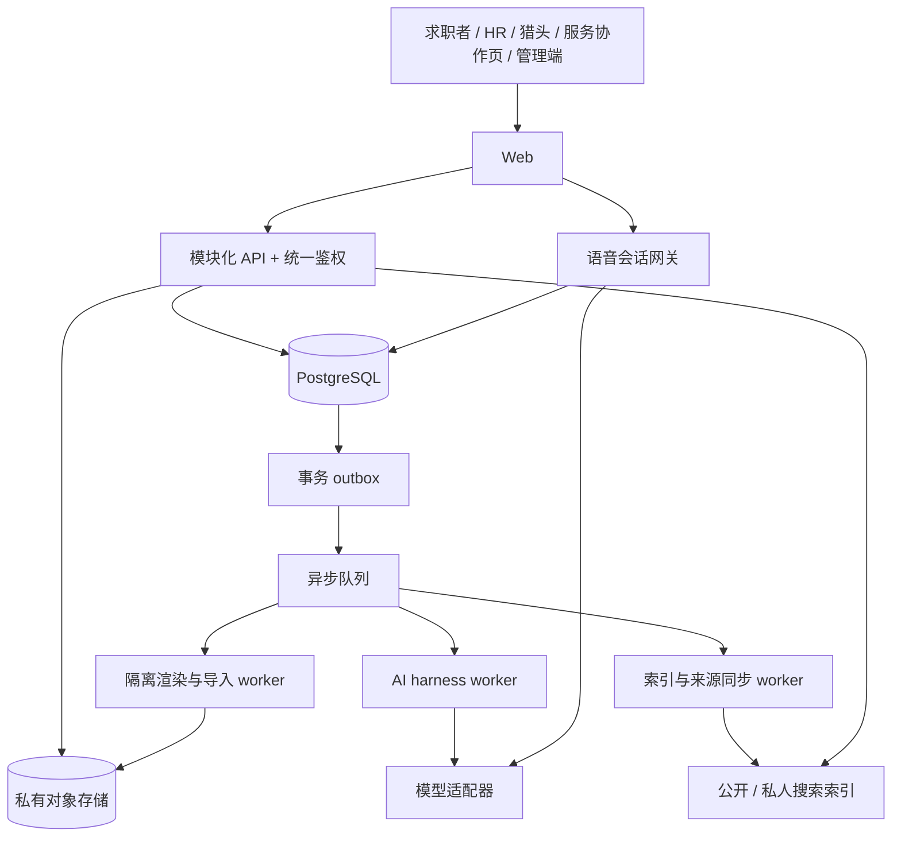

# 找工作工作台：技术实现方案

日期：2026-09-16 · 状态：技术建议基线，尚未实施。

本方案依据[产品研究与功能设计](找工作工作台-产品研究与功能设计.md)，以第 17、18 节及用户最新要求为准。完整服务中国互联网／技术类实习、校招、社招；工程分阶段交付不等于缩减平台范围。配套阅读：[实施规划](../../tasks/plan.md)、[任务与验收清单](../../tasks/todo.md)。

## 1. 先确定的技术方向

1. **JSON、YAML、LaTeX、Typst 均进入正式支持范围。**支持意味着可解析或编译、编辑、预览、保存版本、导出；仅保存上传文本不算完成。四者职责不同，不承诺任意格式无损互转。
2. 默认体验为中文 A4 单栏、可视化编辑、PDF 投递。底层保存版本化内容模型，原生模板配置用 JSON，也提供等价 YAML。高级用户可以保留自己的 LaTeX／Typst 工程。
3. 建立一个模块化后端，独立运行排版、AI、文件处理任务。采用关系数据库维护身份、授权、版本和交易；暂不把每个业务模块拆成微服务。
4. AI 是可以暂停、重试、审阅的工作流程。简历事实、经历显隐、投递材料和用户实际回答，不交给模型自行决定或改写。
5. 正式应用重新建立类型、组件、API、权限与测试。现有 Sites 原型继续作为交互参考；保留已认可的界面与流程，不把演示中的角色切换和 localStorage 当成生产架构。
6. 猎头、企业 HR 有独立工作区。合作方核验、谈判与收款对接可以由平台负责人线下完成，系统负责记录审核结果、合同权益、到期状态和具体数据权限。

### 为什么纳入 Typst

Typst 是文档排版系统，与 LaTeX 一样可由源码生成排版结果。它对本项目的价值已有直接证据：参考项目 RenderCV 的官方用法从 YAML 生成 PDF，同时输出 `.typ` 源码。因此支持 Typst 能衔接既有简历生态，值得建设；本方案不声称其国内用户规模已经达到 LaTeX 水平。[RenderCV 官方说明](https://docs.rendercv.com/user_guide/)、[Typst 官方文档](https://typst.app/docs/)。

## 2. 架构与选型

| 层次 | 建议基线 | 为什么这样选／主要代价 |
|---|---|---|
| Web | Next.js、React、TypeScript；响应式桌面优先 | 工作台与公开岗位／面经页面共用组件；私有页面禁止公共缓存。维护公开页面与登录状态的边界 |
| API | NestJS 模块化单体，REST + OpenAPI | 权限、审核、订单与工作流可集中约束；前端不直接操作数据库或承载业务规则 |
| 数据库 | PostgreSQL；SQL migrations + 类型化查询层 | 事务处理版本、权限、订单；JSONB 放版本文档，关键关系和状态保留列与约束 |
| 文件 | 私有 S3 兼容对象存储 | 源码、附件、PDF 分别存储；下载由鉴权网关授予短时权限 |
| 异步任务 | BullMQ + 经兼容验证的 Redis 服务；事务 outbox | API 快速返回任务 ID；数据库是任务业务状态权威，队列只是投递器 |
| 文档渲染 | 隔离 Python／CLI worker；Typst、RenderCV、TeX | 原生模板首选 Typst 输出；YAML 接 RenderCV 适配器；LaTeX 独立镜像。承担字体、依赖与安全维护成本 |
| 检索 | PostgreSQL 精确过滤；Meilisearch 中文关键词检索；向量索引作为 AI 检索补充 | 公开岗位与面经、私人复盘分开索引；权限仍由数据库复核。增加索引同步和撤回处理 |
| 实时会话 | 浏览器音频 + 服务端会话网关；流式 ASR → LLM → TTS | 便于保存真实转写、控制题单和替换中文语音供应商；断线和轮次管理需要专门实现 |
| 观测 | 结构化日志、trace、错误与成本指标 | 一次用户操作贯穿 API／队列／模型／编译任务；正文和录音不进入普通日志 |

上述为本项目建议，非已部署能力。具体依赖在立项时固定稳定版本、镜像摘要、许可证清单和锁文件；不依赖浮动 `latest`。Next.js 负责页面与交互，NestJS 负责业务，避免两处重复鉴权和订单逻辑。技术依据：[Next.js](https://nextjs.org/docs)、[NestJS](https://docs.nestjs.com/)、[BullMQ](https://docs.bullmq.io/)、[Meilisearch 语言支持](https://www.meilisearch.com/docs/resources/help/language)。中文搜索质量必须用本项目语料测量，不能由“支持中文”直接推断达标。



服务模块按身份、求职计划、简历、模板、岗位、私人机会、投递、面试、复盘、社区、合作方、交易、通知划分。跨模块通过应用服务和事件协作；不允许模块随意改别人表。只有负载、隔离或部署需求成立时再拆服务。

## 3. 数据模型：把容易混淆的对象分开

| 聚合 | 核心对象与关系 | 必须保持的约束 |
|---|---|---|
| 身份 | User、Identity、Organization、Membership、Verification | 一人可兼多角色；角色切换不产生新权限，企业权限限定组织 |
| 求职空间 | CareerPlan(stage)、Experience、Evidence | 阶段枚举 internship／campus／experienced；计划各自管理投递与日程，个人经历库可复用 |
| 简历 | Resume、ResumeDraft、ResumeRevision、Artifact | 多份简历各自版本链；草稿可变、命名版本不可变；内容与模板版本共同冻结 |
| 模板 | Template、TemplateRevision、SourceBundle、Adapter | 来源为内置／自建／私有导入／市场；工程入口与依赖必须可追溯 |
| 授权 | AccessGrant、DisplaySnapshot、ShareLink | 主体、对象版本、用途、字段范围、有效期、撤销时间明确；公开展示与投递互不继承 |
| 招聘 | Company、PublishedJob、JobSource、ReferralPartner、ReferralCode | 公共岗位有发布者、来源和生命周期；内推合作不自动授予招聘者权限 |
| 私人管理 | PrivateOpportunity、Application、ApplicationEvent、Task | 私人机会只有本人可见；投递引用不可变材料，不从岗位收藏推断已经投递 |
| 面试 | InterviewEvent、MockSession、QuestionSet、Turn、TranscriptSegment | 实际面试与练习分别建模；一场真实面试可关联多次模拟 |
| 内容 | ReviewDocument、ReviewRevision、CommunityPost、QuestionSource | 私密复盘与公开面经是独立对象；公开复制必须主动发起；题源许可独立 |
| 商业 | Listing、Order、Entitlement、ServiceOrder、RewardClaim、LedgerEntry | 支付、取得模板权限、交付、返现、服务商结算分别有状态与凭证 |

关系主键用不可猜测 ID，但 ID 不是权限机制。货币存整数分与币种，时间保存 UTC 与用户时区；日期型字段如毕业年月不强行转午夜时间戳。金融事件追加记录，不直接改余额冒充账务。

### 简历版本的具体语义

- `ResumeDraft` 自动保存，携带 revision counter；并发修改使用 If-Match，冲突返回差异，不静默后写覆盖。
- 保存正式版本时，冻结内容、经历显隐、模板版本、来源工程、字体与引擎清单、语言、来源关系。每份简历独立编号，复制会创建新的简历 ID。
- “恢复旧版本”生成基于旧版的新草稿／新版本，不改写历史；AI 修改、英文翻译、切换模板都有可查看的差异。
- 简历字段引用经历来源时，版本内必须保存当时的文字副本；修改经历库不自动修改已投递材料。
- 隐藏是明确的条目／字段状态。送模型、导出、招聘展示前生成目的专用数据投影，隐藏内容不进入该投影。AI 不可恢复它。
- 外部源码可能已经包含隐藏文字或样例文字：上传时保留私人原件，但分享／投递／导出前单独预览审查；不能承诺任意源码里的隐私都能靠表单开关自动删除。
- 取消创建流程不落正式简历；临时上传文件按 TTL 清理。回收站恢复原 ID；删除简历撤销展示，不删除投递存证关系。个人彻底删除与交易法定保留另行按实际政策执行。

## 4. 四种格式的正式支持合同

“JSON／YAML”是序列化语法，“LaTeX／Typst”是排版语言。扩展名相同不代表遵循同一份简历协议。导入识别必须显示方言、版本、引擎、可编辑方式和限制。

| 输入类型 | 导入与编辑 | 预览／PDF | 导出 | 明确边界 |
|---|---|---|---|---|
| 平台 JSON 内容／模板／组合包 | JSON Schema 校验；表单与源码双向编辑 | 内容 + 模板经原生渲染器生成 | JSON、等价 YAML、PDF；选定模板可生成 Typst 工程 | 内容、模板、完整备份用不同 kind；仅模板导出不能携带经历 |
| JSON Resume | 映射公开字段，确认导入内容；保留未知扩展 | 使用用户选定模板 | 兼容 JSON Resume，给出扩展丢失清单 | 它是内容结构，不能假设带有原布局。[官方 schema](https://jsonresume.org/schema) |
| 平台 YAML | safe parser + 同一结构校验；表单与源码编辑 | 同原生 JSON | YAML、JSON、PDF | 往返保证支持字段语义；不保证原注释和键顺序在表单编辑后完全不变 |
| RenderCV YAML | 识别锁定版本的 cv／design／locale 等；内容和设计分别确认 | 官方渲染适配器与固定主题依赖 | YAML、PDF、生成的 Typst 工程 | 仅支持经过兼容测试的方言版本；设置中的路径和输出选项由平台安全策略接管 |
| LaTeX `.tex`／工程 ZIP | 源码编辑、依赖检查、模板字段映射；适配模板提供表单 | 隔离 TeX 编译；中文默认 XeLaTeX，允许已测试的 LuaLaTeX／pdfLaTeX 配置 | 原工程／当前工程、PDF | 任意宏工程可走源码模式；依赖不支持时给错误和补救，不伪装表单可编辑 |
| Typst `.typ`／工程 ZIP | 源码编辑、包版本锁定；适配模板提供表单 | 隔离 Typst 编译 | 工程、PDF；声明了数据映射的模板可导出结构化内容 | 不自动保证 LaTeX ↔ Typst 无损互转 |

**正式完成门槛**：每种格式至少有可运行中文与中英混排样例、真实编辑后结果更新、重新打开版本一致、可下载 PDF／源文件、明确失败状态。外部源码编译成功与“内容可结构化编辑”是两个独立能力标记。

### 4.1 默认方案与数据规范

默认使用平台 `ResumeDocument v1` 与 `TemplateManifest v1`，公开 JSON Schema 和示例；通过 adapter 支持外部方言。内容字段包含基本信息、求职意向、教育、经历、项目、技能、自定义章节、字段来源、显隐与排序。个人主记录可含证据，投递导出默认不含私人证据或 AI 内部记录。

模板配置是声明式设计参数；原生渲染器把参数和已筛选内容编译为受控 Typst 输入。选 Typst 是为了让默认排版与支持范围共用一个引擎；最终采用以中文排版、分页和文本提取验证结果为门槛。LaTeX 始终保留独立路径，不要求用户迁移源码。

下面只是目标 manifest 的结构示例，不是已发布规范：

```json
{
  "kind": "qicheng-template",
  "schemaVersion": 1,
  "engine": "typst",
  "entry": "main.typ",
  "engineVersion": "locked-by-build",
  "contentSchema": "qicheng-resume/v1",
  "adapter": "native/v1",
  "capabilities": ["source-edit", "form-edit", "pdf-export"],
  "assets": [],
  "dependencies": [],
  "fontSet": "cjk-approved-v1",
  "license": {"id": "review-required", "sourceUrl": ""}
}
```

导入 manifest 的能力、许可证和信任状态是待验证声明，服务端不能照单全收。原型 `type:qicheng-template` 的简化 JSON 通过专用迁移适配器接入，不悄悄假定等同新规范。

### 4.2 源码与表单如何共同存在

原生 JSON／YAML 采用单一内容权威，表单和源码是两个视图。源码通过校验才更新草稿；保留无效源码工作副本与最后可渲染版本，不能因打字中的语法错误丢失内容。

LaTeX／Typst 工程采用两种清晰模式：

- **受支持模板模式**：数据放独立文件，模板引用数据；表单只改数据，源码只改布局。用户改动数据接口后重新验证 adapter。
- **自由源码模式**：源码是权威，允许编辑、编译、版本比较；结构化抽取只作为待确认候选。转为原生编辑会创建新副本，保留原工程和转换报告。

不尝试同时维护两个会独立变化的“事实真源”。用户切换模式时明确哪些字段可映射，哪些仅存在源码中。

### 4.3 工程包与安全编译

上传 → 隔离区 → 类型与大小校验 → 解包检查 → 识别入口／依赖 → 用户确认内容／模板 → 编译 → PDF 检查 → 私人模板库。建议起始上限单包 20 MB、解压后 100 MB、500 文件，编译 30 秒／512 MB；这些是待压力测试调整的策略值，不是能力实测。

ZIP 拒绝路径穿越、绝对路径、符号链接、重复路径和压缩炸弹。YAML 禁止对象实例化与自定义执行标签，限制 alias 扩展和嵌套。LaTeX 禁止 shell escape，限制文件读取根目录；Typst 包从审核镜像解析、固定版本，不能任务运行时任意联网安装。用户素材不能成为 worker 启动脚本。

每任务独立无凭证环境、只读运行时、受限临时目录、CPU／内存／进程／文件数限额和断网；生产评估 gVisor 或 microVM 等强化隔离。仅用普通进程隔离不足以运行陌生工程。超时清理、取消终止进程、毒任务重试上限与隔离告警必须实现。

编译缓存键含内容／模板／字体／引擎／依赖摘要和输出策略；缓存读取仍鉴权。分页预览使用最终 PDF 或该 PDF 的图片，避免浏览器预览与下载各用一套排版。检测文字可提取、中文缺字、溢出、页数、空白页；“ATS 友好”是可测工程属性，不作百分百通过承诺。

## 5. 权限与角色：不能只隐藏菜单

登录默认手机号验证码，预留邮箱与第三方身份绑定；验证码限速、防枚举、绑定更改复核。Web 使用 HttpOnly／Secure 会话 cookie、CSRF 防护；管理员与合作方敏感操作增加二次验证。身份验证供应商、短信通道在目标地区实测后固定。

| 身份 | 默认可见内容 | 特别约束 |
|---|---|---|
| 求职者 | 本人经历、简历、计划、机会、投递、复盘 | 可选三个阶段；切换不公开资料、不丢历史 |
| 企业 HR | 本组织岗位与对应投递；获授权展示快照 | 组织成员资格＋岗位操作权限；不能查询全站私人资料 |
| 猎头 | 本人合作范围、授权社招展示、本人推荐流程 | 核验通过＋权限有效；实习／校招资料不可因切角色进入猎头查询 |
| 人工服务方 | 指定订单约定材料和交付 | 默认无需完整账号；短时协作凭证只绑定一个服务单 |
| 管理员 | 分职责管理审核、运营、财务 | 普通运营无权读取全量私密正文；敏感访问填写原因并审计 |

API 做基于角色、组织、资源、用途的授权；数据库关键表加行级保护。PostgreSQL 表所有者和特权账号可能绕过 RLS，因此应用连接使用非所有者、无 BYPASSRLS 账号，按需要 FORCE RLS；事务中的用户上下文不可跨连接复用泄露。[PostgreSQL 官方说明](https://www.postgresql.org/docs/current/ddl-rowsecurity.html)。

外部展示授权锁定某个版本，更新需重新确认。联系方式授权与简历可读权限分开；猎头转推某家公司另建目的授权。拒绝授权时不能以收费关系覆盖用户选择。

负责人线下核验猎头／HR → 管理端录入核验范围、依据、有效期 → 发邀请 → 绑定身份 → 开通权益。付费成功不等于身份核验成功。撤销组织成员或身份资格后，现存会话和链接再次请求立即重新判权。

服务方链接保存 token 哈希、到期和撤销时间；兑换为受限会话，材料下载另鉴权，敏感材料绑定联系人验证。URL token 不写日志；重发撤销旧 token。已下载文件无法远程收回，界面不得承诺可以撤销对方已持有的副本。

## 6. 岗位、私人机会、投递与内推

公共岗位有草稿／待审／公开／暂停／关闭／过期状态，来源为管理员、核验 HR、授权合作数据或有委托依据的猎头。求职者添加记录只写 PrivateOpportunity；从公共岗位加入私人机会保存来源 ID 和当时岗位摘要。

对接企业源需要来源白名单、稳定外部 ID、来源更新时间、同步时间、内容摘要与关闭信号；无 ID 时按公司／职位／城市做候选去重，不自动合并不确定记录。岗位详情始终展示官方链接或明确注明暂无；同步失败显示新鲜度，不能把旧岗位装成新发布。

推荐先过求职阶段、方向、城市等硬约束，再按偏好与时效排序，给出推荐理由和“不感兴趣”；AI 匹配分只做解释辅助。私人机会不会被拿来发布或跨用户推荐。

Application 保存渠道、时间、状态事件和实际使用的 ResumeRevision／PDF 哈希。内推码复制、打开外站、填表、提交成功分开记录；自动填表以用户确认的信息为输入，提交前预览。插件只在用户触发的招聘页面获取必要字段；复杂网站不依赖无约束自动投递。

内推合作档案保存公司、负责人、代码／链接、适用岗位、有效期、曝光与可验证反馈。年费和套餐可配置，1 万／3 万是商业实验假设，不写成固定收入预测。平台记录合同权益和线下收款状态，不需要先建设自助购买入口。

## 7. AI harness：把可靠性变成系统能力

采用显式工作流和受约束工具。优先覆盖经历整理、简历诊断、岗位定向改写、英文草稿、题单生成、模拟追问、复盘建议和检索问答。每类任务有输入 schema、来源范围、输出 schema、质量检查和费用上限。

任务状态：`queued → running → awaiting_user → succeeded`，也可进入 `failed / cancelled / expired`。持久化 TaskRun、StepRun、输入版本、提示版本、工具调用、模型版本、预算和审阅结果。数据库 outbox 与业务写入同事务；worker 重复投递依靠幂等键防止重复创建简历／扣费。

一次定向简历任务：

1. 冻结岗位说明和用户选定简历版本，按显隐过滤事实。
2. 提取岗位要求，引用来源段落，列出缺证据项。
3. 生成有字段路径的修改建议，不直接覆盖整篇。
4. 校验数字、时间、公司、人名、显隐与来源；无法证明的内容标为待用户补充。
5. 用户逐项接受／拒绝；基于原始版本做并发校验后保存新版本。
6. 渲染并检查溢出；任务保留可解释记录。用户预算耗尽时返回已有结果和恢复入口。

外部岗位、面经、上传文档、源码注释都是不可信数据，不进入系统指令。工具权限由服务端确定，不能让模型扩大可见范围。Agent 无支付、审核身份、公开发布或真实提交求职材料的默认权限；这些行为使用既有业务确认流程。

模型接口隔离成文本、嵌入、语音识别、语音合成能力；供应商选择取决于中文技术面试质量、目标地区可达性、延迟、数据处理条款和成本实测。供应商切换记录版本并重新跑评测，不承诺不同模型效果相同。

评测集包含事实不变、隐藏经历不泄露、提示注入、来源撤回、技术答案错误、中文英文术语和中断恢复。评价“能否帮助下一次行动”，不只评价文风和生成长度。评测使用合成或经授权样本，不能把真实简历偷偷放公共测试集。

## 8. 语音模拟面试与自动复盘

面试日程是上下文入口，用户也可创建独立练习。准备信息由岗位版本、简历快照、轮次、方向、来源题单和用户自定义题构成。

### 8.1 组卷与问答

题源按公司／方向／阶段／时间／许可过滤、去重和覆盖知识点；不足时展示补充题类别，不伪称公司真题。自定义-only 模式严禁添加题库问题；是否允许追问作为选项。题目保存 source ID、来源版本、引用片段和授权状态，先审核后可供检索。

浏览器明确开启麦克风；服务端网关负责会话鉴权、轮次和供应商连接。初始正式路径为流式 ASR → 用户确认／可选自动提交 → LLM → TTS，可配置结束检测与打断。后续原生语音模型必须满足同等题单控制和转写审计要求，不能绕过问答记录。

保存转写 segment ID、轮次、时间戳、原始转写、用户修订版和提交状态。重复片段幂等；断线恢复最后确认轮次，不把半句当成完整回答。语音故障可切文字，文字故障不丢服务端已保存回答。暂停不计活动语音时长，主动结束后不继续生成问题。

### 8.2 结束不等于马上生成成功

结束时先落盘 Question／ActualAnswer，再异步生成 ReviewDocument：问题、实际回答、未作答标记、参考答案、知识来源、总结、练习建议。生成失败显示“问答已保存，复盘待生成”，允许重试且只生成同一会话的一份归档文档，另存重新生成版本。

原始回答和 AI 派生内容分区；AI 不得填补用户没说的话。跳过补写只结束编辑，不删除自动归档。真实面试状态仍由用户维护，模拟完成不自动把真实日程改为“已完成”。

录音默认不长期保存，只保留转写与确认记录；确需复听由用户单独开启录音留存，显示到期日和删除入口。流式供应商的处理与留存条件属于上线前核验项。

## 9. 复盘库、面经与搜索

复盘以 Markdown 为源格式，支持标题、标签、岗位／面试关联、自动保存、版本恢复、导出和全文检索。编辑器不执行 HTML 脚本，预览做白名单清洗。AI 建议单独保存，用户插入时记录来源，禁止静默覆盖用户正文。

公开面经从空白或用户选定的复盘片段创建独立草稿，脱敏提示、作者确认、审核、发布；匿名公开不意味着平台无法处理举报。文章公开阅读与允许 AI 抽题分别授权。撤回后立即禁止 API 检索与新组卷，索引异步删除；已生成用户笔记保留必要历史标记，不继续展示撤回的受限原文。

搜索索引分公开内容与私人文档；私人索引记录 owner／plan／grant 范围，查询过滤加数据库复核后才返回正文、摘要和数量。不得先把其他人的片段送模型再过滤结果。索引不是权限真源；删除／撤权先在主库生效，后台处理索引和向量同步。

关键词用于公司名、术语和原句，向量用于相似问题，融合排序后给出处。中文质量集覆盖缩写、技术中英混写、同义表达、错别字；精确编号和公司名不能被语义匹配替代。

## 10. 市场与人工服务的交易实现

### 模板市场

市场商品区分纯模板、脱敏示例、讲解资料和组合包。上架记录来源、版权声明、包含文件、渲染依赖、价格、版本与可用权限。付费获取的是约定版本的使用权与可编辑副本，不赋予买家作者的经历真实性。导入首先选择自己的内容；作者示例可单独阅读，不进入用户事实库。

支付回调验签、金额／币种／商户订单核对、事件幂等，服务器确认到账后授予 Entitlement。下载鉴权不依赖前端成功页。订单状态与退款状态分开；退款按商品政策调整后续下载权限，已下载文件不能假装收回。卖家更新模板不自动修改买家已有版本。

### 人工服务与返现

建议即使线下支付，也由平台先创建服务单／预约 ID，记录服务种类、提供者、双方确认金额、约定佣金规则与版本、授权材料、交付时间。这样成交归因不完全依赖聊天截图。

流程：预约 → 服务方接受 → 用户确认合作 → 交付 → 用户提交中性反馈／证据 → 审核 → 返现记录 → 服务商对账。用户申请 10 元返现是独立 RewardClaim；佣金应收是独立 SettlementItem。用户证据只是核对依据，不能凭截图自动向服务商扣费。

返现按服务单唯一，校验重复用户／凭证、金额与时间合理性，必要时双方确认，允许争议。费用规则随服务单冻结，退款和撤销以冲正记录处理。对服务方承诺的固定入驻费、订阅费、成交服务费可组合试验，但系统必须解释每笔费用的依据。

管理端支持人工核验、交付争议、奖励批准、付款核销、服务商账单与导出。返现不与好评挂钩。只靠 10 元返现仍无法保证全部成交被发现，因此不以它作为唯一商业计量基础。

## 11. API 契约与可靠性约束

| 示例接口 | 关键契约 |
|---|---|
| `POST /v1/resumes` | templateRevision + optional sourceResumeRevision；原子创建独立草稿；取消流程不调用 |
| `PATCH /v1/resumes/:id/draft` | If-Match；冲突 409，返回可恢复信息 |
| `POST /v1/resumes/:id/revisions` | 产生不可变版本；重复幂等键返回同一结果 |
| `POST /v1/imports`、`POST /v1/renders` | 202 + jobId；状态查询／SSE；客户端不能指定任意文件路径或系统命令 |
| `POST /v1/grants`、`DELETE /v1/grants/:id` | 当前主体确有授权权力；锁定用途／版本／字段；撤销即时生效 |
| `POST /v1/jobs` | 公司成员资格＋发布权限；求职者请求被拒绝 |
| `POST /v1/opportunities` | 仅本人私有；不会创建公共招聘信息 |
| `POST /v1/mock-sessions/:id/finish` | 幂等结束；返回归档任务；不会更改真实面试状态 |
| `POST /v1/reviews/:id/public-drafts` | 显式选择分享内容；创建独立草稿，绝不直接发布 |
| `POST /v1/orders` | 服务器定价、优惠与币种校验；前端金额不可信 |
| `POST /v1/payment-events/:provider` | 验签与重放防护；状态迁移与权益授予事务一致 |

所有创建／支付／完成会话请求带幂等键，作用域含用户、操作和请求摘要；同键不同参数返回冲突。重试带上限与退避。API 错误区分用户可修正、权限不足、供应商暂时失败和内部故障；日志关联 trace ID，不显示密钥或内部栈。

## 12. 部署、运维与成本

采用独立 dev／staging／production 环境，生产数据库、存储、模型密钥和编译镜像均隔离。优先选择对中国目标用户可达且支持容器、WebSocket、对象存储、数据库备份的部署环境；在确定运营主体和地域后核验实际接入条件。不能用当前演示网址的体验代替国内网络和手机实测。

Sites 保留原型迭代作用。生产后端、编译任务、实时语音和支付独立部署；如果后续继续用 Sites 托管部分页面，也必须验证域名、登录 cookie、跨域、缓存和连接能力，不把它当成未经验证的全栈前提。

流水线：类型与 lint → 单元／契约 → 数据库迁移验证 → 集成／权限 → 浏览器流程 → 镜像扫描 → staging → 小流量发布。迁移先扩展后切换再清理，禁止发布直接破坏旧字段。备份必须演练恢复；任务中断能恢复；发布可回退代码和关闭功能，不能回滚丢掉已经发生的交易。

建议首轮测试目标，**均非已测成绩**：

| 指标 | 初始验收目标／条件 |
|---|---|
| 普通 API | 100 并发活跃用户的代表性负载下，读请求 p95 < 500 ms，排除长任务 |
| 标准简历 PDF | 固定 2 页中文样本，队列等待单列统计；暖 worker 渲染 p95 < 5 s |
| 外部源码工程 | 达到资源上限时可解释失败，取消后释放资源；不以无限等待换兼容 |
| 中文检索 | 100 条人工标注查询；结果相关性与权限泄露分别验收，越权结果必须为零 |
| 语音交互 | 指定国内移动／宽带网络测试，回答提交后首段播报 p95 < 3 s；达不到时优化或提示降级 |
| 数据恢复 | 初始 RPO ≤ 1 小时、RTO ≤ 4 小时，必须用恢复演练证明，按预算调整 |
| 资金与版本 | 重复回调／队列重放不重复入账，不改变历史快照 |

每次 AI 任务记录输入输出 tokens、缓存、语音秒数、渲染 CPU 时间和存储占用。单次成本 = 模型调用 + ASR + TTS + 编译计算 + 存储／流量分摊；月成本另加数据库、检索、短信和运维固定费用。未取得报价与真实使用分布前，不给出虚假的精确月预算。限制单会话时长、并发和金额上限，超限前提示并保存进度。

## 13. 复用开源项目的方式

| 资源 | 建议复用范围 | 接入前验证 |
|---|---|---|
| [RenderCV](https://github.com/rendercv/rendercv) | YAML 适配、主题、渲染流程 | 固定版本、中文字体／换行、依赖镜像、许可证与主题资产 |
| [JSON Resume](https://jsonresume.org/schema) | 内容交换与 schema 映射 | 字段兼容、扩展字段导出报告、版本策略 |
| [sb2nov/resume](https://github.com/sb2nov/resume)、[hijiangtao/resume](https://github.com/hijiangtao/resume) | 外部 LaTeX 模板兼容样本 | 固定 commit 后检查模板／字体许可与编译条件 |
| [Reactive Resume](https://github.com/reactive-resume/reactive-resume)、[OpenResume](https://github.com/xitanggg/open-resume) | 编辑交互、数据结构与导入体验参考 | 不直接拼装两个完整产品；逐文件复用须核对当时许可证 |
| [Resume Matcher](https://github.com/srbhr/Resume-Matcher) | 匹配解释和评测思路 | 不把相似度等同录用概率；检查模型与数据来源 |
| 用户提供的职位／投递跟踪项目 | 字段、状态机、交互和集成案例 | 不将 GitHub 可访问等同允许复制数据或运营网站接口 |

这里是复用计划，不表示本轮已完成全部仓库的代码或许可证审计。此前产品研究保留完整项目清单；正式选用时只暂存必要仓库，记录版本与依据后按用户要求清理研究克隆，生产依赖则通过锁文件和合法分发包管理。

## 14. 从原型迁移与完整交付标准

当前原型可验证页面、流程和部分本地操作，但没有真实身份核验、云端权限、支付、LLM、可靠语音服务或源码编译。正式构建不能把演示按钮视为后端已完成。

迁移只导入用户主动导出的本机内容，做 schema 识别、预览和逐项确认。演示公司、虚构订单、角色资格和已付款标记一律不升级成真实生产数据。源文件导入前重新检查，示例数据与真实账户隔离。浏览器内密码、旧站账号等绝不写入配置、种子数据或文档。

完整交付必须同时通过以下用户旅程：

- 实习／校招／社招三种入口及计划切换；待办自主添加；周日期能切换。
- 四格式导入编辑渲染导出；模板来源开放；复制任意简历、取消、隐藏、英文副本、版本比较恢复、投递快照稳定。
- 公共岗位浏览／推荐、官方跳转、公司内推；私人机会与投递跟踪；角色限制真实有效。
- 选择实际面试 → AI 语音／文字或人工模拟 → 自动归档 → Markdown 复盘搜索 → 自愿发布面经与题源授权。
- 猎头线下核验线上开通、企业 HR 发布管理、按单服务协作，互不越权。
- 市场购买与导入、人工服务确认交付、返现审核、费用对账、退款与争议闭环。

每项与工程任务的对应见 [todo](../../tasks/todo.md)。格式支持、语音可靠性、权限和交易是上线门槛，不通过时标明未完成，不通过隐藏入口把范围算作完成。

## 15. 浏览器扩展专项技术补充

详见[六款竞品研究与扩展方案](浏览器扩展-竞品研究与实现补充.md)。正式采用 MV3 侧栏、限域授权会话、版本化站点适配器、规则优先与受约束 AI 映射；加入 ApplicationProfile、FillRun、SiteAdapterVersion 等对象。扩展取当前授权版本的结构化投影，不能从完整经历库补回隐藏经历。填表、网页自动保存、附件上传、最终申请成功分别记录。明确受限撤销、worker中断恢复、站点兼容矩阵及诊断数据最小化。工程见[E01–E09](../../tasks/extension.md)，补充而非替代原 T51 试验。


## 16. 国际化与海外扩展的技术约束

当前国内优先，后续支持海外与英语。以下是本项目设计要求，不表示海外数据源、语音或招聘站点已接入。

### 16.1 从国内建设阶段纳入的基础

- User 保存 `uiLocale` 与 `timeZone`，CareerPlan 保存目标市场，Resume 保存内容语言，MockSession 保存面试语言；公司所在地、岗位地点、远程可工作地区分别建模。显示语言不能成为鉴权或岗位资格判断依据。
- 文案使用 message key 和翻译目录；不拼接中文句子或将后端错误直接作为界面文案。预留英文文本长度、复数、日期／数字格式和语言回退。用户原文不因切换界面语言自动翻译。
- 电话保留国家区号与用户输入，地址按国家使用可配置字段，姓名不强制所有人都有相同的姓／名拆分。招聘字段使用稳定语义 ID、地区标签与选项字典，禁止以中文 label 作为数据库键。
- 金额保存数值、币种及周期（小时／月／年），保留是否含奖金等原始说明；未确认汇率与基准前不直接跨币种排序。原有整数最小单位设计需结合币种精度配置，不能把所有币种都当作“分”。
- 时间点以 UTC 保存并记录 IANA 时区；纯日期、年月和当地重复日程分别表达。测试夏令时跳过／重复时刻，不能仅存固定 UTC 偏移。
- 默认模板继续中文 A4 单栏；模板 manifest 增加支持语言、字体集与纸张规格。英文和中英混排跑排版验收；中文转英文保留源版本关系，英文用户也能直接新建，不强制先有中文原稿。
- 索引保留原始语言与地区元数据，中英文关键词和技术术语分别评测；跨语言检索可选，不自动将用户原文翻译后覆盖。

### 16.2 海外阶段接入的能力

英文 UI 完整覆盖求职者主路径、错误、通知与帮助；AI 任务显式指定输出语言，语音识别、合成与追问按语言和目标地区选择供应商并独立评测。英语面试评测覆盖口音、技术术语、打断、转写纠错和参考答案质量。

扩展 adapter 按域名、招聘系统、地区、表单版本和语言声明兼容范围，字段语义与页面语言分离。海外招聘系统需要单独样本和站点验证，不能因采用同一 ATS 就推断跨地区全兼容。资格回答绑定国家、用户确认时间和本次岗位；过期或冲突时重新确认。

部署增加 region 配置及数据路由边界，实际进入某个市场时才决定是否新增区域实例；不为尚未确定的海外范围提前建设全球多活。模型、语音、存储和支付的数据路径、可用性与合同范围作为该市场上线门槛。

### 16.3 验收与迁移

国内验收包含中英混排、英文简历与数据结构不绑定中文；海外验收额外包含完整英文界面、英文语音/复盘、当地岗位来源和扩展表单、跨时区日程与币种展示。历史国内数据迁移为明确的默认 locale/market，同时允许用户修正，不从语言反推国籍或工作许可。工程任务见 [I01–I04](../../tasks/todo.md)。


## 17. 记录驱动生成、通用 Harness 与改进闭环

新增 Note／NoteRevision／Project、选定来源范围、逐块 CoverageManifest、带原文位置的 EvidenceClaim；已有经历库接受用户确认后的事实。Conversation、Run、StepRun 与 ArtifactRevision 分开，生成产物和多轮补丁复用简历版本 API；本次选择需全量处理，检索不能代替阅读全部选中材料。

在现有 T31 工作流上增加任务修订、来源覆盖、事实冲突、可管理记忆、产物差异与旧输出淘汰。运行、工具、观测与 UI 协议可复用，先在简历生成与面试复盘两场景验证；不立即另建通用多租户平台。

从首个真实 Agent 起配置结构化事件、跨服务 trace、版本与费用、质量反馈、授权评测、灰度和回滚。产品分析、运行诊断、审计和授权研究样本分别管理；后台不默认暴露工作笔记正文。告警必须有实际动作、负责人和故障演练。具体字段、指标口径、阈值候选与数据删除边界见[专项架构](工作记录与Agent工作台-产品架构与持续优化.md)，补充[ADR-006](../decisions/006-agent-workspace.md)。
