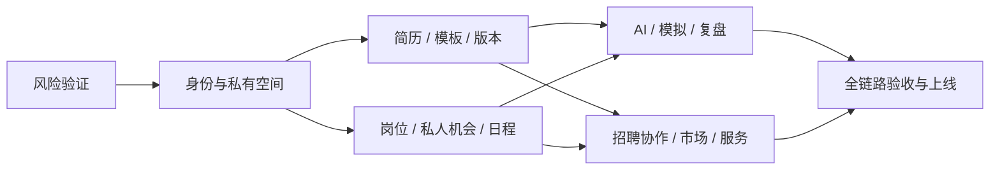

# 找工作工作台：实施规划

日期：2026-09-16。状态：待进入工程实施；本次只交付文档，没有实现生产功能或更新线上原型。

主文档：[技术实现方案](../docs/design/找工作工作台-技术实现方案.md)。产品依据：[产品设计](../docs/design/找工作工作台-产品研究与功能设计.md)。执行入口：[任务清单](todo.md)。

## 1. 规划原则

目标是完整求职平台，覆盖三类求职者、企业 HR、猎头、服务合作方与运营管理。分阶段的意义是先验证高风险，再逐段形成可用闭环；不将后面的模块当成可以无限推迟的愿望清单。

每阶段交付可运行路径，维护四种状态：设计完成、演示可用、真实实现、生产验收。当前原型仅处于演示阶段。任务未达到验收条件不能因页面已经出现而勾选完成。

技术选型见 ADR：[系统边界](../docs/decisions/001-system-boundaries.md)、[格式与渲染](../docs/decisions/002-resume-formats.md)、[快照与授权](../docs/decisions/003-snapshots-and-grants.md)、[AI 与语音](../docs/decisions/004-ai-workflows.md)、[交易账务](../docs/decisions/005-transactions.md)。这些是本轮技术建议，供应商和确切版本经验证后锁定。

## 2. 里程碑与退出标准

| 里程碑 | 工作包 | 用户能完成什么 | 退出标准 |
|---|---|---|---|
| M0 风险验证 | T01–T06 | 在实验环境验证四格式、中文语音、权限边界 | 有样本、失败报告、运行资源与成本记录；确定可支持的方言和依赖版本 |
| M1 账号与求职空间 | T07–T11 | 真正登录，选择三阶段，管理自己的经历和待办 | 两个真实测试账号互不可读；会话撤销有效；计划切换不丢数据 |
| M2 简历与开放模板 | T12–T23 | 从任意模板和已有简历创建、编辑、版本管理、真实导出 | JSON／YAML／LaTeX／Typst 全链路；中文字体和预览一致；隐藏与快照验证通过 |
| M3 招聘与投递 | T24–T30 | 公共岗位与私有机会分开，收藏、内推、记录投递、日历安排 | 发布权限生效；官方来源、过期、重复同步处理正确；每次投递材料可追溯 |
| M4 AI、模拟、复盘与社区 | T31–T40 | 定向改写、英文简历、语音模拟、复盘搜索、面经发布与组卷 | 真实模型与语音；中断恢复；自定义-only；撤回题源不再参与新检索 |
| M5 多方合作与商业闭环 | T41–T49 | 猎头／HR 协作、按单人工服务、市场购买、返现与结算 | 线下核验与线上权限联动；订单幂等；奖励和佣金分别可对账 |
| M6 插件、运营与上线验收 | T50–T55 | 导入旧资料、受控填表、通知、跨端稳定使用 | 完整用户旅程、隔离、备份恢复、费用与负载指标达标，运营流程有负责人 |

阶段按业务闭环组织，不要求所有阶段严格串行。例如 HR 身份核验应在岗位发布阶段建设；M5 扩展招聘处理与猎头推荐。模板交易依赖模板库和账务，但不依赖语音模拟完成。



## 3. 工作目录建议

以下目录尚未创建为生产项目，仅作为任务定位；不覆盖 `prototype/`：

```text
apps/web/                    页面、交互、各角色工作区
apps/api/                    领域模块、权限、API、迁移
apps/voice-gateway/          实时会话和音频协议
workers/ai/                 harness、工具和质量校验
workers/render/             原生、RenderCV、LaTeX、Typst 适配器
workers/indexer/             搜索索引、撤回与删除同步
packages/contracts/         schema、OpenAPI、事件协议
packages/resume/            内容模型、转换、显隐和差异
packages/templates/         manifest、模板适配协议
infra/                      本地环境、镜像、部署与恢复
quality/                    授权样本、评测与浏览器验收
```

所有任务的建议文件路径都相对此目录方案。正式脚手架产生后再将路径绑定实际文件，避免为了满足计划硬拆已有代码。每项控制在 1–5 个主要文件；若落地发现需要跨多个独立子系统，拆分任务再执行，不能靠一个巨型文件伪装小任务。

## 4. 人员、时间与成本安排

尚无团队规模、投入时长、预算、供应商合同和正式发布日，不能据此给可靠日历工期。先执行 M0，记录实际投入和集成障碍，再为后续任务估算并形成发布日历。AI 辅助能加快部分代码工作，但不能省略语音网络实测、身份运营、资金联调和真实用户反馈。

建议角色能力覆盖：产品与设计、Web／后端、AI／语音、文档渲染、安全与测试、合作方运营。同一人可兼任；负责人亲自对接猎头与人工服务资源，工程提供可审计的邀请、授权和核销工具。

预算拆为一次性建设、基础服务固定费、按量模型与语音费、短信／流量、服务与返现运营支出。返现预算、服务商应收款、平台营收分别建账；不把未验证的内推年费收入抵消确定发生的成本。M0 输出单位成本与预计业务量场景，供选择供应商和套餐。

## 5. 风险优先验证

| 风险 | 提前验证 | 失败后处置 |
|---|---|---|
| 任意源码无法表单化 | T02–T04：标准适配与自由源码分别验收 | 保留源码编辑和 PDF；明确不能映射字段，创建转换副本 |
| 中文字体与分页差异 | 中英混排、长链接、多页、罕见字样本 | 固定字体集、修模板；禁止静默替换原样式 |
| 陌生模板执行风险 | 路径越界、shell、联网、无限循环样本 | 阻断上线编译，完善隔离；不能只加免责声明 |
| 语音延迟／断线 | 国内手机／桌面真实网络、打断和重连 | 优化协议／供应商，保留文字降级，语音指标不达标不宣称完成 |
| 授权泄露 | 双用户、跨公司、过期令牌、撤回后的搜索 | API 与数据库双重修复，删除异步不影响即时拒绝 |
| 费用重复计算 | 重复队列、重复回调、退款、证据争议 | 幂等与冲正；证据争议转人工，不自动扣服务方费用 |
| 平台内容不足 | 记录首批模板、岗位、授权面经和服务方来源 | 负责人组织种子内容与合作，不生成虚假岗位／面经充数 |

## 6. 每个检查点必须检查什么

每完成 3 个任务或一个里程碑，运行受影响模块检查、类型检查与构建，演示对应用户路径，记录截图／测试结果／已知限制。与产品负责人核对关键交互反馈；这属于实施中的验收安排，不阻碍本轮完成规划文档。

进入真实付费与外部招聘协作前，必须验证退款、账单、身份撤销与权限例外；进入公网前，必须有恢复演练、异常监控、客服与举报处理入口。首次放量按验证过的容量进行，保留功能开关和回滚路径。

## 7. 需要后续落定的配置，不阻碍现在设计

- 运营主体、部署地域、短信／支付与语音供应商可用性：M0／采购阶段核验。
- 首批模板和开源依赖的确切版本与分发权：T02–T04 后锁定。
- 猎头、内推伙伴与服务方的收费规则：商业合作确认后配置，系统先支持版本化规则。
- 原生模板的正式品牌和默认中文字体：M2 视觉验收时确定。
- 初始容量与预算上限：根据 M0 压测和真实目标用户量决定。

以上不需要用户此刻逐项回答，也不改变 JSON、YAML、LaTeX、Typst 和完整平台范围。

## 8. 浏览器扩展范围补充

六款竞品研究后，将 T51 从单一末期试验扩展为[九项正式交付任务](extension.md)。T51 提前至 M2/M3 验证，E01–E07 随简历与岗位流程推进，E08 接入 M4 AI，E09 在 M6 验收；T53 依赖 E09。功能包含私人岗位收藏、网申资料、指定简历版本、复核填写、个人筛选、恢复撤销与投递确认。证据与边界见[专项研究](../docs/design/浏览器扩展-竞品研究与实现补充.md)。


## 9. 国内优先与海外阶段

当前 M0–M6 聚焦完整国内平台。新增 I01 国际化数据与文案基础，在 M1/M2 完成；I02 英文简历和语言隔离验收，在国内版 T53 验收前完成。当前不把海外数据源接入设为国内上线前提。

国内闭环稳定后，进入海外阶段：I03 完整英文界面、英文 AI/语音与跨时区体验；I04 按目标市场增加岗位来源和扩展适配。海外阶段启动时选择首个国家／地区，按实际招聘系统、用户需求、数据与服务可用性拆出站点和语言任务，尚不预设覆盖全部国家。

产品、技术和任务分别见产品第20节、技术第16节与[todo 的 I01–I04](todo.md)。第一阶段就避免中文硬编码；海外业务能力仍需单独完成和验收，不能用技术预留代替交付。


## 10. 工作记录、AI 首页与可复用运行层

完整国内范围增加工作记录到简历的多轮会话闭环，以及后台反馈、统计和告警。[A01–A13](agent-workspace.md)依赖原任务复用既有存储、版本与 T31，不另建孤立 AI 系统。

M1/M2 完成记录、材料选择与来源版本；M2–M4 完成 AI 首页、全量阅读、事实卡、简历产物和持续修改。A08 必须伴随首个真实 Agent 上线，M4 完成反馈与评测，M6 前完成后台和故障演练，并用面试复盘验证框架复用。T53 全旅程验收增加 A12/A13 依赖。本轮只是记录方案，没有开始实现。

产品主指标围绕任务有用交付，兼顾事实准确、隐私、成本和时间；记录行为与会话行为只作为分析线索，需用明确反馈与授权案例验证解释。框架提取以两个业务场景的重复需求为依据，避免提前建设过大的抽象层。
